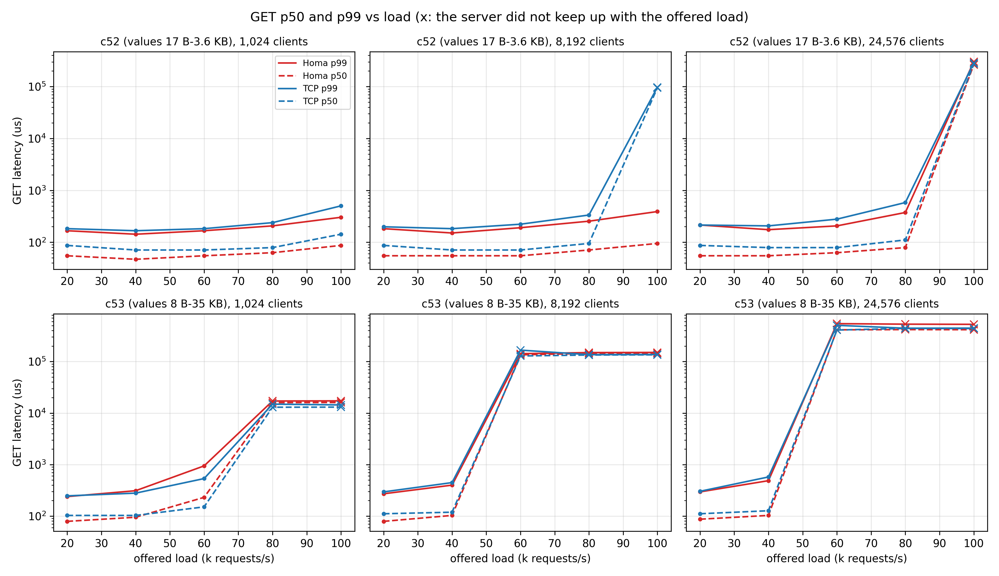
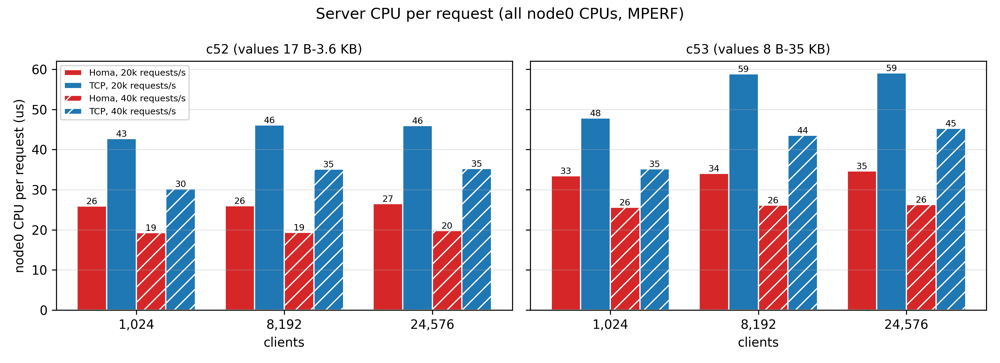
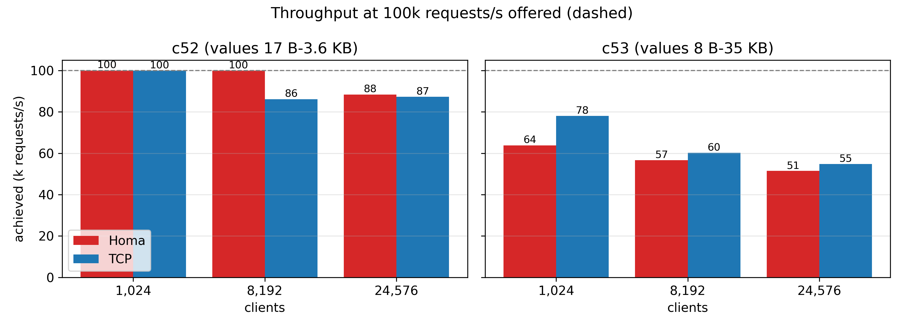
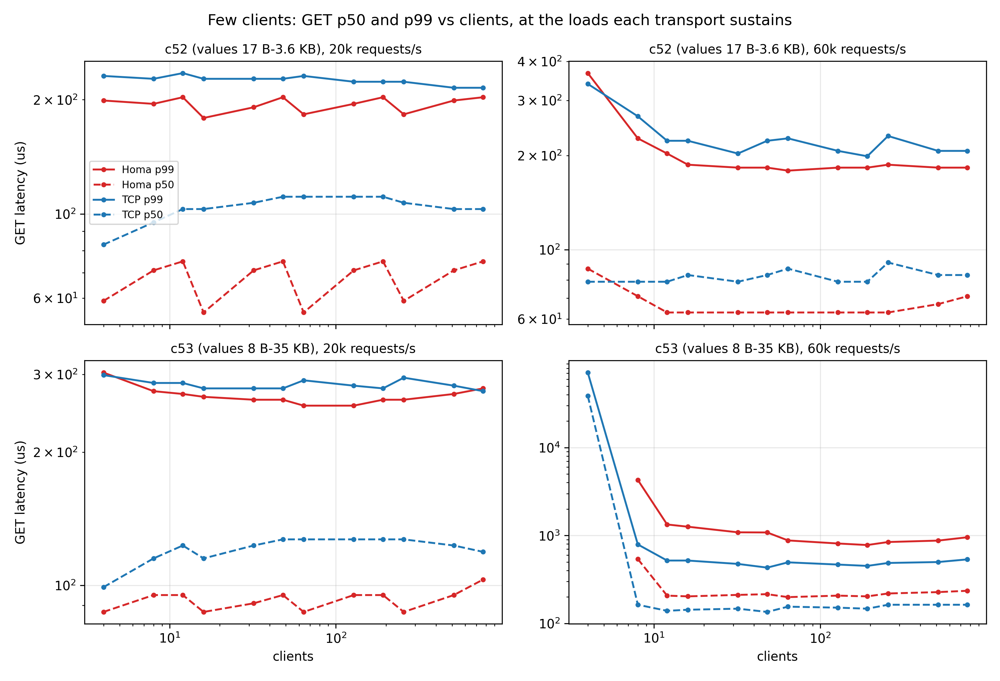
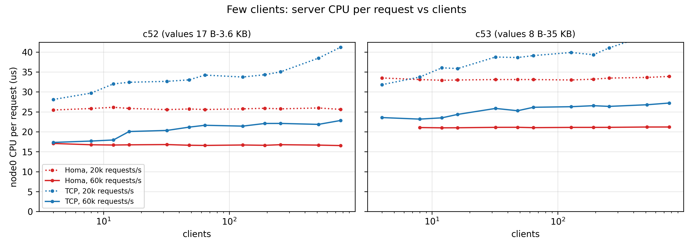

# Redis over Homa vs TCP: a client fleet against one Redis shard

One single-threaded Redis shard serving 4 to 24,576 independent clients over Homa and over
TCP, on 2x CloudLab Utah xl170 (25 Gb/s), with request sizes and mixes from the Twitter cache
trace.

## Client, server and threading model

| Component | Repository and version | Role |
|---|---|---|
| Homa | <https://github.com/PlatformLab/HomaModule/tree/1c59d7b6>, `main` @ `1c59d7b6` | kernel module, `sch_homa`, the CloudLab `config` tool |
| Redis with a Homa transport | <https://github.com/uoenoplab/smt-redis/tree/homa-6.17.8>, branch `homa-6.17.8` @ `f749cd4dd` | the server (and `redis-cli` for preload checks) |
| memtier_benchmark with Homa | <https://github.com/uoenoplab/memtier_benchmark/tree/homa>, branch `homa`: `9006af8` for 1,024-24,576 clients, `7f8b5a3` (the branch tip) for 4-768 (on <https://github.com/redis/memtier_benchmark/tree/7a6394e> `7a6394e`) | the client fleet |
| Scripts | this branch: `fleet-xl170.sh`, `tcpclean.sh`, `busy-cores.sh`, `homa-timer-busy.sh`, `plot.py` | runs, host state, CPU sampling, figures |

**Server** (node0): one redis-server process with a single event-loop thread (`--io-threads 1`)
pinned to CPU 7; it parses and executes every command. Over TCP each client has its own socket and
the event loop polls all of them with epoll. Over Homa one socket serves every client: when it is
readable, the event loop drains the ready RPCs with `recvmsg` and hands each to the Redis client
object of its peer (ip:port), which runs the commands; each RPC's replies leave as one `sendmsg`.

**Load generator**: memtier_benchmark is Redis Ltd.'s open-source load generator for Redis and
Memcached (<https://github.com/redis/memtier_benchmark/tree/master>). It emulates many clients from one
process: worker threads, each running a libevent loop that drives many client connections, every
connection speaking the Redis protocol and recording per-request latency into HDR histograms. Our
fork adds a Homa transport (each client one Homa socket, the protocol code unchanged), open-loop
Poisson arrivals and request mixes drawn from a trace (see Changes below).

**Clients** (node1): one memtier_benchmark process with 16 worker threads on CPUs 0-3, 5-13 and
15-18. Each thread runs one libevent loop that drives C clients (C = 64, 512 or 1,536, so
N = 16 x C = 1,024, 8,192 or 24,576). A client is one TCP connection or one Homa socket with one
request in flight (`--pipeline=1`): its next request goes out only after the reply arrives. Each
client's requests arrive as a Poisson process of LOAD/N per second (LOAD = 20k-100k requests/s in
total); an arrival that finds the previous request still in flight waits for it.

**Kernel**: the NIC interrupts (NAPI) of the node pair land on node0 CPU 1 and node1 CPU 4, which
the applications avoid; Homa's `homa_timer` kthread is pinned to CPU 19 on both nodes.

**Few clients**: a second sweep uses 4, 8 or 12 threads x 1, 4, 16 or 64 clients per thread
(N = 4 to 768) at 20k and 60k requests/s, otherwise the same, with 2 rounds.

**Runs**: a fresh redis-server once node0 is idle; 100,000 keys preloaded; 5 s warm-up (not
counted); 20 s measured; CPU sampled for 4 s mid-run as MPERF/TSC on every CPU of both nodes;
3 rounds, medians reported.

## Test rationale

- **The simplest exchange.** Each client sends one request and waits for its reply before the
  next (one request in flight), as an application thread does with a synchronous client library
  (redis-py, Jedis, hiredis) and a connection pool.
- **Many clients contending for one server core.** Thousands of such clients share one Redis
  core, so requests from different clients queue behind each other at the server: head-of-line
  blocking across clients, made worse when a small reply waits behind another client's large one.
  This is where the transports differ: TCP keeps a socket per client, Homa one for all, and Homa
  sends the shortest remaining message first.
- **Not head-of-line blocking within one stream.** Redis executes a client's commands in order on
  one thread, so a client that pipelines many requests over one connection is serialized by Redis
  anyway; letting a later reply overtake an earlier one in the transport gains little, and Homa's
  per-message cost (one `recvmsg` and one `sendmsg` per request, where TCP batches several requests
  per read) makes it lose there. We therefore do not pipeline.

When each Homa property should help, and what cancels it:

| Homa property | Pays off when | Cancelled when | Here |
|---|---|---|---|
| Connectionless: the server's kernel state does not grow with the number of clients (one socket for all; TCP keeps one socket per client) | many clients | few clients each sending densely, where TCP batches by itself | 1,024-24,576 clients, one request in flight each |
| Message-based, shortest remaining message first: a small reply is not queued behind another client's large one | sizes mixed across clients, egress the bottleneck | ordering inside one client, or a single-threaded endpoint that must process a large message whole | c53 mixes 8 B to 35 KB |
| Receiver-driven grants: incast without loss | many senders replying to one receiver | (needs more than two machines) | not tested |

### The workloads: c52 and c53

c52 and c53 are two clusters of Twitter's in-memory cache (Twemcache) trace: one week of requests
to 54 production clusters, published with Yang, Yue and Rashmi, "A large scale analysis of hundreds
of in-memory cache clusters at Twitter", OSDI 2020 (<https://github.com/twitter/cache-trace/tree/master>). We
used the sampled per-cluster files from CMU PDL
(<https://ftp.pdl.cmu.edu/pub/datasets/twemcacheWorkload/open_source/>, `clusterNN.sort.sample100.zst`):
the first 20,000,000 requests of cluster 52 and all 2,468,148 of cluster 53.

| | c52 | c53 |
|---|---|---|
| Trace statistics (the paper's table) | 24.3k requests/s, third busiest of 54; mean key 20 B, mean value 273 B; get 91%, add 4%, gets 2%, cas 2%; Zipf 1.21 | 1.4k requests/s; mean key 36 B, mean value 9.2 KB; get 89%, prepend 9%, set 3%; Zipf 1.21 |
| Why this cluster | the busiest whose mean value exceeds 100 B (the two busier ones average 8 B and 37 B, single-packet messages) | values spread over four orders of magnitude: the mix where a small reply can queue behind a large one |
| GET value sizes, weighted by requests | 17 B-3.6 KB; 58% are 27 B | 8 B-35 KB; 25% over 16 KB |
| SET:GET | 7:93 | 13:87 |

How the memtier inputs were built from the trace: the value sizes of GET/GETS requests that hit
(value size > 0) were binned at a factor of 1.41 (half a power of two); each bin became one
`size:weight` entry of `--data-size-list`, the bin's median size weighted by its share of requests
(per 10,000). The SET:GET ratio counts every write type (set, add, cas, replace, prepend, append,
incr, decr) as a SET. Keys are not taken from the trace: 100,000 keys drawn uniformly, all
preloaded, so every GET hits.

| Workload | `--data-size-list` (size in bytes : weight per 10,000 GETs) |
|---|---|
| c52 | `17:38,27:5751,38:199,54:39,70:23,117:10,151:240,216:383,306:531,434:732,607:1172,753:605,1149:220,1543:51,2403:3,3648:5` |
| c53 | `8:717,16:304,24:251,40:713,56:310,72:215,98:241,128:73,231:41,280:91,432:322,528:79,912:1009,1136:388,1749:30,2574:41,3432:73,5049:125,7326:514,9801:323,13695:1594,18711:386,26961:1592,35343:567` |

## Results: 1,024-24,576 clients





- **Server CPU**: Homa needs 18-44% less node0 CPU per request at every client count and load
  both sustain (the most at low load and many clients), and its cost does not grow with the client count (c52 at 40k: 19.3-19.9 us over
  Homa, 30.2-35.3 over TCP; c53 at 40k: 25.6-26.3 against 35.2-45.3).
- **c52 (small values)**: Homa's GET p50 is 20-40% lower and its p99 0-40% lower at every load
  both sustain; at 8,192 clients Homa sustains 100k requests/s (p99 391 us) while TCP
  saturates at 86k.
- **c53 (mixed sizes)**: at 20k and 40k requests/s Homa's p50 is 8-30% lower and the p99s are
  within 15%; at 1,024 clients and 60k TCP is ahead (p50 151 vs 231 us, p99 535 vs 943); TCP saturates later at
  every client count (78k vs 64k, 60k vs 57k, 55k vs 51k). The single Redis core sets capacity,
  and Homa does more work on it per message (one `recvmsg` and one `sendmsg` per message, a
  multi-KB message copied in one call) although it does less on the node as a whole.
- **Offered load reached**: every run at 20k and 40k requests/s achieved its offered load within
  0.4%. Where a transport fell more than 2% short of the offered load, its latency only measures
  the backlog, so the figure and the tables give no latency there, only the load it achieved.

**c52** (latency only where the achieved load is within 2% of the offered)

| clients | load | Homa p50 / p99 (us) | TCP p50 / p99 (us) | node0 CPU per request, Homa / TCP (us) |
|---:|---:|---:|---:|---:|
| 1,024 | 20k | 55 / 167 | 87 / 183 | 25.9 / 42.7 |
| 1,024 | 40k | 47 / 143 | 71 / 167 | 19.3 / 30.2 |
| 1,024 | 60k | 55 / 167 | 71 / 183 | 16.8 / 23.5 |
| 1,024 | 80k | 63 / 207 | 79 / 239 | 14.8 / 19.3 |
| 1,024 | 100k | 87 / 303 | 143 / 503 | 13.4 / 16.3 |
| 8,192 | 20k | 55 / 183 | 87 / 199 | 26.0 / 46.1 |
| 8,192 | 40k | 55 / 151 | 71 / 183 | 19.4 / 35.1 |
| 8,192 | 60k | 55 / 191 | 71 / 223 | 16.9 / 28.4 |
| 8,192 | 80k | 71 / 255 | 95 / 335 | 15.0 / 24.0 |
| 8,192 | 100k | 95 / 391 | saturated at 86k | - |
| 24,576 | 20k | 55 / 215 | 87 / 215 | 26.5 / 46.0 |
| 24,576 | 40k | 55 / 175 | 79 / 207 | 19.9 / 35.3 |
| 24,576 | 60k | 63 / 207 | 79 / 279 | 17.1 / 28.5 |
| 24,576 | 80k | 79 / 375 | 111 / 583 | 15.2 / 24.1 |
| 24,576 | 100k | saturated at 88k | saturated at 87k | - |

**c53** (latency only where the achieved load is within 2% of the offered)

| clients | load | Homa p50 / p99 (us) | TCP p50 / p99 (us) | node0 CPU per request, Homa / TCP (us) |
|---:|---:|---:|---:|---:|
| 1,024 | 20k | 79 / 239 | 103 / 247 | 33.5 / 47.8 |
| 1,024 | 40k | 95 / 311 | 103 / 279 | 25.6 / 35.2 |
| 1,024 | 60k | 231 / 943 | 151 / 535 | 21.2 / 28.0 |
| 1,024 | 80k | saturated at 64k | saturated at 78k | - |
| 1,024 | 100k | saturated at 64k | saturated at 78k | - |
| 8,192 | 20k | 79 / 271 | 111 / 295 | 34.1 / 58.9 |
| 8,192 | 40k | 103 / 399 | 119 / 447 | 26.1 / 43.6 |
| 8,192 | 60k | saturated at 57k | saturated at 58k | - |
| 8,192 | 80k | saturated at 56k | saturated at 61k | - |
| 8,192 | 100k | saturated at 57k | saturated at 60k | - |
| 24,576 | 20k | 87 / 295 | 111 / 303 | 34.7 / 59.1 |
| 24,576 | 40k | 103 / 487 | 127 / 575 | 26.3 / 45.3 |
| 24,576 | 60k | saturated at 52k | saturated at 54k | - |
| 24,576 | 80k | saturated at 52k | saturated at 55k | - |
| 24,576 | 100k | saturated at 51k | saturated at 55k | - |

Runs at 20k and 40k offered: 96; largest deviation of achieved from offered: 0.4%

## Results: 4-768 clients




- **TCP's extra server cost starts with the first connections.** With 4 clients both transports
  spend the same node0 CPU per request (c52 at 60k: 17.1 us over Homa, 17.3 over TCP); TCP's cost
  then grows with the client count (20.1 us at 16 clients, 22.8 at 768), Homa's stays at
  16.5-17.1 us. With c53: 21.0-23.4 against 23.2-27.2 us at 60k.
- **c52**: Homa's GET p50 and p99 are lower at every point but 4 clients at 60k (p50 87 vs 79 us,
  p99 367 vs 339); at 20k its p50 is 20-50% lower.
- **c53**: at 20k Homa's p50 is 13-31% lower and the p99s are within 10%. At 60k, close to Homa's
  c53 capacity (64-69k in the fleet sweep), TCP's p99 is 1.8-2.4x lower from 12 clients on.
- Homa's p50 at 20k depends on the number of client threads: 55-59 us with 4 threads (4, 16, 64,
  256 clients), 71-75 us with 8 or 12; hence the zigzag in the figure.
- At 60k with 4 clients each client has to carry 15k requests/s with one request in flight, close to
  what one client can do; with c53 that point measures the clients (TCP's p50 is 39 ms, Homa does
  not keep up), not the transports.

**c52**: GET p50 / p99 (us) and node0 CPU per request (us), Homa | TCP

| clients | 20k Homa | 20k TCP | 60k Homa | 60k TCP |
|---:|---:|---:|---:|---:|
| 4 | 59 / 199, 25.5 | 83 / 231, 28.1 | 87 / 367, 17.1 | 79 / 339, 17.3 |
| 8 | 71 / 195, 25.8 | 95 / 227, 29.7 | 71 / 227, 16.7 | 79 / 267, 17.7 |
| 12 | 75 / 203, 26.1 | 103 / 235, 32.0 | 63 / 203, 16.7 | 79 / 223, 17.9 |
| 16 | 55 / 179, 25.9 | 103 / 227, 32.4 | 63 / 187, 16.7 | 83 / 223, 20.1 |
| 32 | 71 / 191, 25.6 | 107 / 227, 32.6 | 63 / 183, 16.8 | 79 / 203, 20.3 |
| 48 | 75 / 203, 25.7 | 111 / 227, 33.0 | 63 / 183, 16.6 | 83 / 223, 21.2 |
| 64 | 55 / 183, 25.6 | 111 / 231, 34.2 | 63 / 179, 16.6 | 87 / 227, 21.6 |
| 128 | 71 / 195, 25.7 | 111 / 223, 33.7 | 63 / 183, 16.7 | 79 / 207, 21.4 |
| 192 | 75 / 203, 25.9 | 111 / 223, 34.3 | 63 / 183, 16.6 | 79 / 199, 22.1 |
| 256 | 59 / 183, 25.7 | 107 / 223, 35.0 | 63 / 187, 16.8 | 91 / 231, 22.1 |
| 512 | 71 / 199, 26.0 | 103 / 215, 38.5 | 67 / 183, 16.7 | 83 / 207, 21.9 |
| 768 | 75 / 203, 25.6 | 103 / 215, 41.2 | 71 / 183, 16.5 | 83 / 207, 22.8 |

**c53**: GET p50 / p99 (us) and node0 CPU per request (us), Homa | TCP

| clients | 20k Homa | 20k TCP | 60k Homa | 60k TCP |
|---:|---:|---:|---:|---:|
| 4 | 87 / 303, 33.5 | 99 / 299, 31.8 | saturated at 52k | 38767 / 71423, 23.6 |
| 8 | 95 / 275, 33.1 | 115 / 287, 33.7 | 539 / 4287, 21.1 | 163 / 791, 23.2 |
| 12 | 95 / 271, 32.9 | 123 / 287, 36.0 | 207 / 1335, 21.0 | 139 / 519, 23.5 |
| 16 | 87 / 267, 33.0 | 115 / 279, 35.8 | 203 / 1259, 21.0 | 143 / 519, 24.4 |
| 32 | 91 / 263, 33.1 | 123 / 279, 38.7 | 211 / 1087, 21.1 | 147 / 475, 25.9 |
| 48 | 95 / 263, 33.1 | 127 / 279, 38.6 | 215 / 1083, 21.1 | 135 / 431, 25.3 |
| 64 | 87 / 255, 33.1 | 127 / 291, 39.1 | 199 / 879, 21.0 | 155 / 495, 26.1 |
| 128 | 95 / 255, 33.0 | 127 / 283, 39.9 | 207 / 811, 21.1 | 151 / 467, 26.3 |
| 192 | 95 / 263, 33.2 | 127 / 279, 39.3 | 203 / 779, 21.1 | 147 / 451, 26.5 |
| 256 | 87 / 263, 33.5 | 127 / 295, 41.0 | 219 / 843, 21.1 | 163 / 487, 26.4 |
| 512 | 95 / 271, 33.6 | 123 / 283, 44.2 | 227 / 875, 21.2 | 163 / 499, 26.8 |
| 768 | 103 / 279, 33.9 | 119 / 275, 45.8 | 235 / 955, 21.2 | 163 / 535, 27.2 |

## Changes over the earlier Homa Redis

The earlier Homa port (uoenoplab/smt-redis branch `smt`, 2024) was Redis 7.2.4 against the 2024
Homa user API, chose the transport by port range (5xxx / 6xxx / 8xxx), and its redis-benchmark
blocked on each Homa receive. The version measured here:

- **Redis 8.10.1 and the current Homa API**: the receive pool is an mmap region registered with
  `SO_HOMA_RCVBUF`, buffer pages are recycled across `recvmsg` calls, and `sendmsg` carries
  `homa_sendmsg_args`; the old `homa_hl.c` wrappers are gone.
- **Homa as a Redis `ConnectionType`**, chosen explicitly (`--homa-port`, `redis-cli --homa`), not by
  port range. One socket per listener; a dispatcher drains ready RPCs and hands each to a per-peer
  Redis client (keyed by ip:port), so per-client state (SELECT, MULTI, ...) and command order behave
  as over a TCP connection. One RPC in flight per peer; later ones wait in a queue with their own
  bytes. New peers pass Redis's admission (maxclients, protected mode); idle peers are reaped.
- **Replies leave as one Homa message straight from the client's output buffers** (one `writev`,
  values of 16 KB and more by reference); an RPC without output gets a 1-byte no-reply message, a
  reply over Homa's 1 MB limit an error; a send that hits `EAGAIN` is retried on `EPOLLOUT`.
- **No empty event-loop turn per RPC**: the pending-data hook marks a peer only when it has another
  RPC queued (without this, every reply kept the next `epoll_wait` from sleeping).
- **Client side**: a Homa transport in Redis's vendored hiredis (`redisConnectHoma`), used by
  `redis-cli` and a nonblocking `redis-benchmark`; one RPC in flight per context (Homa may complete
  a later, smaller response first); closing a context sends QUIT, since Homa has no FIN.
- **Load generator** (new): memtier_benchmark with `--homa` (each client one Homa socket, memtier's
  protocol code unchanged), `--rate-poisson` (open-loop Poisson arrivals on absolute times),
  `--sample-mix` (request type and value size drawn per request from the trace's weights),
  `--warmup` and `--no-per-second-percentiles` (per-client per-second percentile summaries stall
  worker threads at thousands of clients).

## Reproduce

| Item | Value |
|---|---|
| Nodes | 2x CloudLab Utah xl170 (`small-lan` profile, LAN on 10.0.1.x): node0 = 10.0.1.1 (Redis), node1 = 10.0.1.2 (clients) |
| Hardware | Intel Xeon E5-2640 v4 (10 cores / 20 threads), Mellanox ConnectX-4 25 Gb/s (`ens1f1np1`) |
| OS | Ubuntu 24.04, mainline kernel 6.17.8-061708-generic, `mitigations=off`, governor `performance` |
| Homa | PlatformLab/HomaModule `main` @ `1c59d7b6` |
| Redis | uoenoplab/smt-redis branch `homa-6.17.8` @ `f749cd4dd`: Redis 8.10.1 with a Homa transport |
| Load generator | uoenoplab/memtier_benchmark branch `homa`: `9006af8` (1,024-24,576 clients, latency from the send) and `7f8b5a3` (4-768 clients, latency from the arrival), on redis/memtier_benchmark `7a6394e` |

### Build (both nodes for Homa and Redis, node1 for memtier)

```bash
git clone https://github.com/PlatformLab/HomaModule && cd HomaModule && git checkout 1c59d7b6
cp -r cloudlab/bin/. ~/bin/ && make -j20 CC=gcc-14 && make -j20 -C util
~/bin/install_homa 2          # from node0: copies homa.ko and tools to both nodes, runs "config default"
git clone -b homa-6.17.8 https://github.com/uoenoplab/smt-redis ~/smt-redis && git -C ~/smt-redis checkout f749cd4dd && make -C ~/smt-redis -j20
# node1
sudo apt-get install -y build-essential autoconf automake libpcre3-dev libevent-dev pkg-config zlib1g-dev libssl-dev
git clone -b homa https://github.com/uoenoplab/memtier_benchmark ~/memtier_benchmark
cd ~/memtier_benchmark && autoreconf -ivf && ./configure && make -j16   # 7f8b5a3, for 4-768 clients
cp -r ~/memtier_benchmark ~/memtier-9006af8 && cd ~/memtier-9006af8 && git checkout 9006af8 && make -j16
```

### Host configuration of each protocol

| | Homa (official CloudLab config) | TCP (kernel defaults, Homa removed) |
|---|---|---|
| Module | `homa.ko` loaded; `num_priorities 8`, `link_mbps 25000`, `unsched_bytes 60000`, `max_incoming 480000`, `max_gso_size 10000`, `max_nic_est_backlog_usecs 5` | `homa.ko` unloaded (`rmmod homa`) |
| qdisc | `mq` with `sch_homa` on all 20 TX queues | `mq` with `fq_codel` (kernel default) |
| RPS / RFS | RPS on every RX queue (mask `fffff`), `rps_sock_flow_entries 32768`, `rps_flow_cnt 2048` | off (RSS only) |
| NIC | `ethtool -C`: `adaptive-rx off rx-usecs 0 rx-frames 1 adaptive-tx off tx-usecs 5`; `-K ntuple off` | same (left as Homa's config set it) |
| Command | `bash -lc "config default"` on each node (`tcpclean.sh off`) | `tcpclean.sh on`: `config reset_qdisc`; `rps_cpus`/`rps_flow_cnt` 0; `rps_sock_flow_entries 0`; `rmmod homa` |
| redis-server | `redis-server --port 6379 --homa-port 2000 --bind 0.0.0.0 --protected-mode no --save "" --io-threads 1 --maxclients 100000` | the same without `--homa-port 2000` |
| Client | `memtier ... -p 2000 --homa` | `memtier ... -p 6379` |

Both: `net.ipv4.icmp_ratelimit=0` on both nodes (a Homa server RPC whose client closed is otherwise
probed every 1 ms until an ICMP gets through); node1 `ip_local_port_range "1024 65535"`,
`tcp_tw_reuse 1`; `ulimit -n 200000`; the `homa_timer` kthread pinned to CPU 19 on both nodes;
NAPI was node0 CPU 1 and node1 CPU 4, so redis-server runs on node0 CPU 7 and memtier on node1 CPUs
0-3, 5-13, 15-18.

The memtier command of one run (c52, 8,192 clients, 60k requests/s; `--rate-poisson` = LOAD/N):

```bash
memtier_benchmark -s 10.0.1.1 -p 2000 --homa --protocol=redis -t 16 -c 512 --pipeline=1 \
  --rate-poisson=7.32421875 --ratio=7:93 --key-pattern=R:R --key-minimum=1 --key-maximum=100000 \
  --data-size-list=17:38,27:5751,38:199,54:39,70:23,117:10,151:240,216:383,306:531,434:732,607:1172,753:605,1149:220,1543:51,2403:3,3648:5 \
  --sample-mix --randomize --distinct-client-seed --warmup=5 --test-time=20 --no-per-second-percentiles --hide-histogram
```

The preload before it, over TCP: the same with `-p 6379 -t 4 -c 8 --ratio=1:0 --key-pattern=P:P -n allkeys`.

### Run (node1, about 5 h)

```bash
for h in node0 node1; do scp busy-cores.sh homa-timer-busy.sh $h:; done
tmux new -d -s fleet 'M9=~/memtier-9006af8/memtier_benchmark
  M=$M9 TRANSPORTS=homa CPT="64 512 1536" bash fleet-xl170.sh > fleet-homa.csv
  export THREADS="4 8 12" CPT="1 4 16 64" LOADS="20000 60000" ROUNDS=2   # few clients
  TRANSPORTS=homa bash fleet-xl170.sh > sweep-homa.csv; unset THREADS CPT LOADS ROUNDS
  bash tcpclean.sh on; M=$M9 TRANSPORTS=tcp CPT="64 512 1536" bash fleet-xl170.sh > fleet-tcp.csv
  THREADS="4 8 12" CPT="1 4 16 64" LOADS="20000 60000" ROUNDS=2 TRANSPORTS=tcp bash fleet-xl170.sh > sweep-tcp.csv
  bash tcpclean.sh off'
uv run --with matplotlib python plot.py
```

Check the host state that `tcpclean.sh` prints before each block: both nodes `20xhoma`,
`rps=fffff` for Homa; `20xfq_codel`, `rps=00000`, `homa=unloaded` for TCP.

| File | What |
|---|---|
| `fleet-xl170.sh` | runs the experiment: fresh server, preload, memtier, CPU sampling; one CSV row per run |
| `tcpclean.sh` | `on`: TCP; `off`: Homa's config |
| `busy-cores.sh`, `homa-timer-busy.sh` | per-CPU busy % (MPERF/TSC); busy % of the `homa_timer` kthread |
| `results/fleet-{homa,tcp}.csv`, `results/sweep-{homa,tcp}.csv` | 1,024-24,576 and 4-768 clients, one row per run; `server_busy_sum` is the sum of node0's per-CPU busy % |
| `plot.py` | the figures and tables |

## Limitations

- **One client host.** node1 holds every Homa socket; `homa_timer`, which visits every socket each
  tick, takes 40% of a CPU at 8,192 clients and 68% at 24,576, and saturates its CPU (96%) at
  24,576 clients and 100k requests/s, so that point measures the client host, not Redis.
- For 1,024-24,576 clients latency is timed from the send of each request (memtier `9006af8`), not
  from its arrival (as for 4-768 clients, `7f8b5a3`); with
  one request in flight per client and at most 100k/1,024 = 98 requests/s per client, a request
  rarely waits behind its client's previous one.
- Near saturation the CPU per request of both transports is inflated; only sustained points are
  compared. What limits Homa at saturation (node0's busiest CPU 87-91% busy, against 94-96% for
  TCP) is not established.
- The TCP runs ran as one block after the Homa runs (`homa.ko` can only be unloaded with no
  Homa socket open). Keys are drawn uniformly, not with the trace's skew; every write is a SET.
