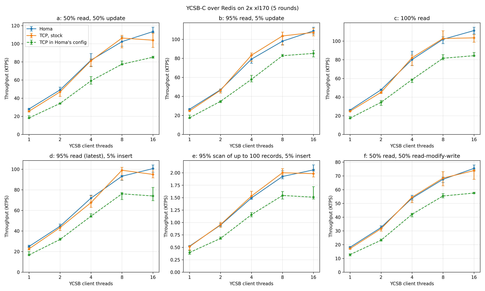
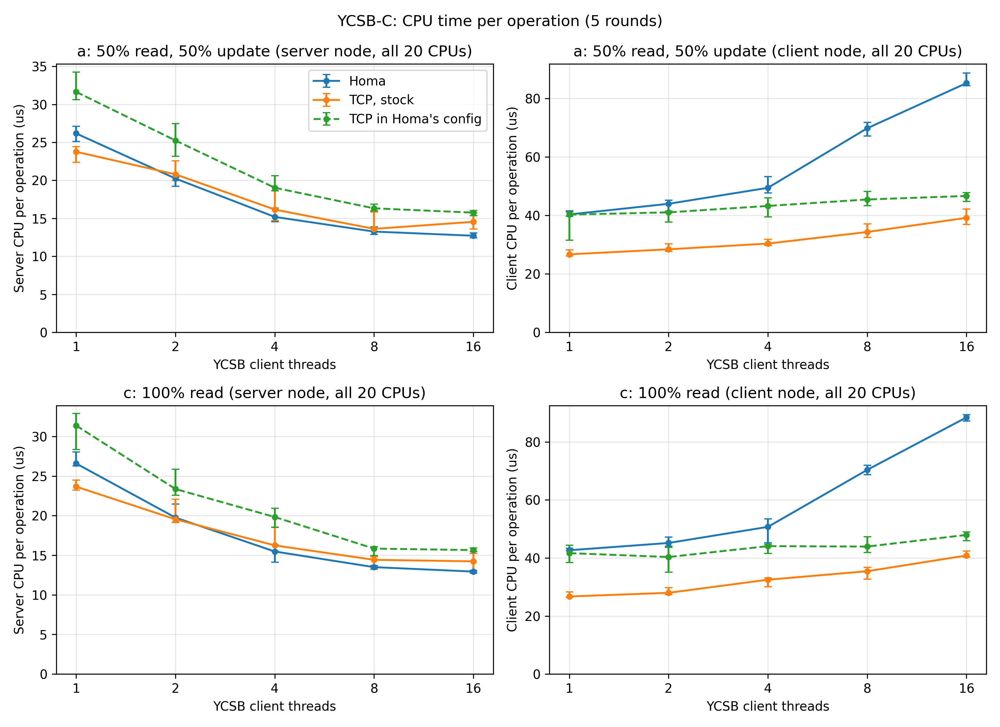
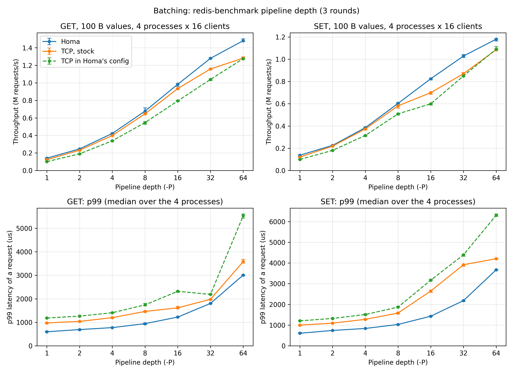
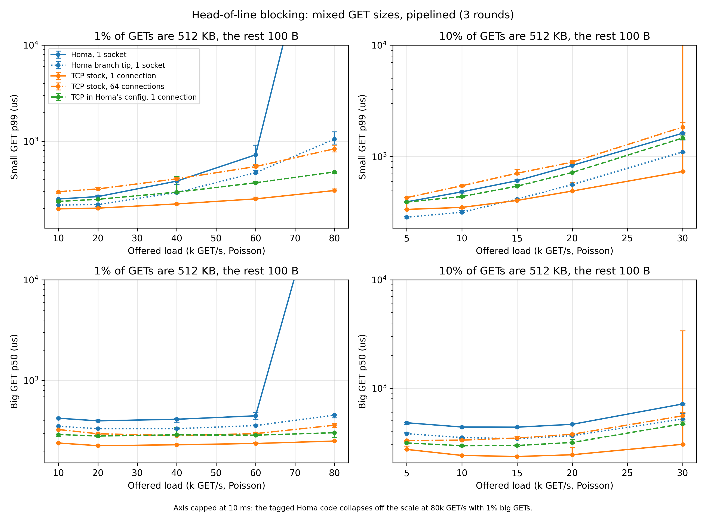
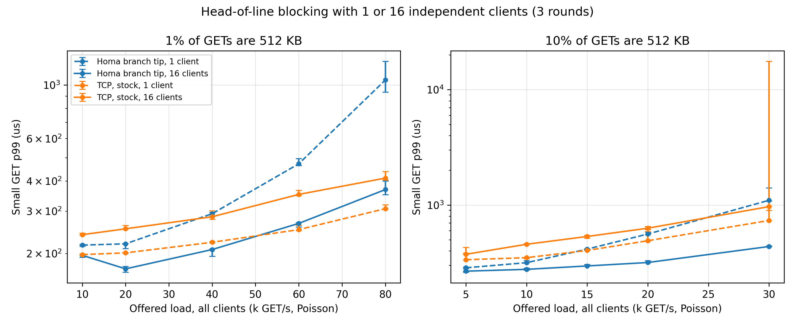
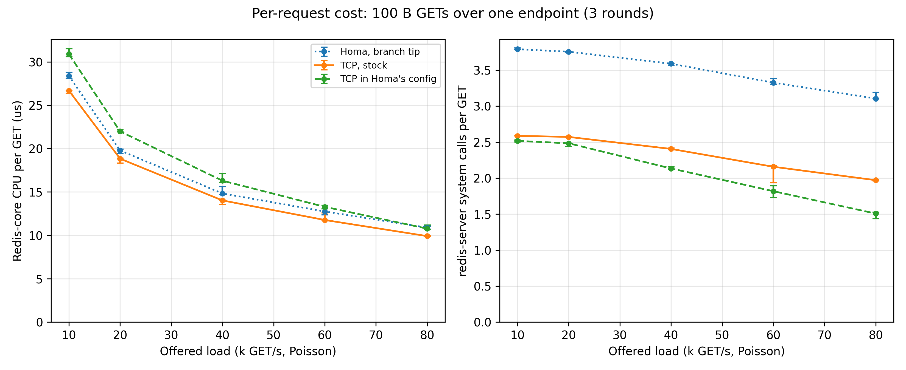
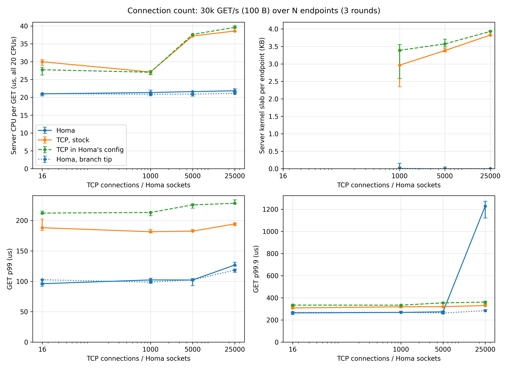

# Homa vs TCP for Redis on CloudLab xl170

Runbook, scripts, raw results and figures for Redis over this repository's Homa transport (branch
`homa-6.17.8`) against TCP, measured on 2026-09-28 on 2x CloudLab Utah xl170 nodes (25 Gb/s) with
upstream Homa and its official CloudLab configuration. Six experiments: YCSB-C (one operation
per request), batching (`redis-benchmark -P`), head-of-line blocking (a mix of 100 B and 512 KB
GETs, from one client or several), the cost of one request over one endpoint, connection count (up
to 25,000 endpoints) and the server cost of one 512 KB reply.

TCP is measured two ways, because Homa's official configuration changes TCP's path too:

| Line | Host state | How |
|---|---|---|
| Homa | Homa's official config (`config default`) | as installed |
| **TCP, stock** (the baseline) | `homa.ko` unloaded: kernel default qdisc (`mq` + `fq_codel`), RSS only (no RPS/RFS) | `tcpclean.sh on` |
| TCP in Homa's config | the official config shared with Homa | how Homa's own TCP comparisons run |

In Homa's config TCP runs with three Homa mechanisms in its way: RPS/RFS (`config rps`, which Homa's
SoftIRQ steering needs; it moves TCP's receive processing onto the application core, here the one
Redis core), the `sch_homa` qdisc and its pacer thread on every TX queue, and the TCP GRO hook that
`homa.ko` installs when it loads (TCP hijacking support, active even with `hijack_tcp=0`). NIC
coalescing, CPU governor and C-states are the same for all three lines.

## Findings

- **One operation per request (YCSB-C, all six standard workloads a-f): Homa is 0.94-1.10x stock
  TCP**, with server CPU per operation within 13% of it and 1.5-2.2x the client CPU (a blocked Homa
  receiver spins for `net.homa.poll_usecs` = 50 us before sleeping; stock TCP does not poll). Against
  TCP in Homa's config the ratio is 1.18-1.54x: the config itself costs TCP 18-30%.
- **Batching**: pipelining lifts all three lines about tenfold (0.10-0.14 M requests/s at `-P 1`,
  1.1-1.5 M at `-P 64`, 64 clients), and Homa stays at 1.03-1.18x stock TCP's throughput at every
  depth, with a 9-46% lower p99. Batching does not change the order: Homa stays level or ahead.
  Without batching by the client, one TCP connection batches by itself under load: over one
  stock-TCP connection a read or a write carries 1.2 GETs at 10k GET/s and 1.5 at 80k (2.0 in Homa's
  config), while Homa receives one message per `recvmsg` and sends one per reply, plus a `recvmsg`
  that finds nothing each time it drains the socket (1.4-1.8 per GET). The Redis core then spends
  5-10% more per GET over Homa than over one stock-TCP connection (40k GET/s: 14.8 against 14.0 us),
  the whole server node 6-12% more, and at 80k GET/s the core is 87% busy against 79%. At 40k GET/s
  the core's extra 0.9 us per GET are 0.5 us of system calls, 0.5 us of protocol (0.3 us of it the
  time tracing upstream Homa always records) and 0.2 us of memory allocation, less 0.2 us each of
  event-loop and interrupt or scheduler work.
- **Head-of-line blocking: Homa wins with many clients and loses with one.** Redis runs one
  client's commands in order on one thread, so a small request behind a big one waits for the big
  reply's server work whatever the transport; Homa can only remove the wait behind it on the wire and
  in the byte stream. With 16 independent clients (one process and one endpoint each), one Homa
  socket per client gives a lower small-GET p99 than one stock-TCP connection per client at every
  load: by 10-32% when 1% of the GETs fetch 512 KB and by 29-55% when 10% do; with 8 clients at all
  but one point, with 4 at low and moderate load. With one client, stock TCP is ahead at all but the
  two lowest loads with 10% big GETs (there Homa is 10-15% lower), by up to 3.4x at 80k GET/s with 1%
  (1049 against 307 us). A single-threaded client gets each 512 KB reply over Homa as one message and
  handles it in one piece, holding back the requests due meanwhile (their send lag p99 reaches 559
  against 186 us), where over TCP it reads the reply in pieces; and one TCP connection carries
  several requests per read and write while Homa pays for every RPC (see Batching). More clients
  spread both costs, while more TCP connections from one client make TCP worse.
- **A 512 KB GET is 1.4-1.8x slower over Homa with one client, 1.1-1.2x with 16**; the transport
  alone is 13% slower for one 512 KB message (264 against TCP's 234 us; 17 against 29 us for 100 B).
  The branch tip, which hands a whole reply to Homa from Redis's buffers at once, cuts 65-99 us off a
  512 KB GET against the tagged code. A 512 KB reply costs the Redis core 103-110 us over Homa and
  90 us over stock TCP, and the whole server node 3.3x stock TCP's (466-468 against 141 us), most of
  it off the Redis core.
- **Homa's clearest win is connection count**: from 16 to 25,000 endpoints stock TCP's server CPU per
  GET rises from 30.0 to 38.6 us (on the Redis core from 15.5 to 16.8 us), plus 3.0-3.8 KB of kernel
  slab per connection; Homa stays at 20.9-21.9 us, with no per-client kernel memory on the server, and
  its GET p99 is lower (96-127 against 182-194 us).

This branch is an orphan: it shares no history with the Redis code.

| Path | What |
|---|---|
| `install-mainline-kernel.sh` | installs mainline 6.17.8 with `mitigations=off` on a node (run as root, then reboot) |
| `ycsb-xl170.sh` | YCSB-C, runs on node1 against redis-server on node0 |
| `batch-xl170.sh` | batching curve with `redis-benchmark -P` |
| `mixload.c`, `mixload-xl170.sh` | open-loop load generator and its driver: `hol`, `multi`, `scale`, `bigcost`, `rpc` |
| `need-ack-probe.sh` | server RPCs left by clients that close without waiting: node0's NEED_ACK rate after 25,000 Homa sockets close |
| `prof-core.sh` | where the Redis core's time goes: a perf profile of it at 40k GET/s, by symbol |
| `cpnode-xl170.sh` | the transport alone: Homa's `cp_node`, one message and a 100 B reply |
| `tcpclean.sh` | switches both nodes to stock TCP (`on`) and back to Homa's config (`off`) |
| `busy-cores.sh` | per-CPU busy % over an interval as MPERF/TSC, the time a CPU executed (all drivers use it) |
| `plot.py` | plain matplotlib, `results/` -> `figures/` (300 dpi PNG), and prints the tables below |
| `results/xl170-upstream-1c59d7b6/` | raw CSVs (one row per run; `-tcpclean` = stock TCP) and `env.txt` |
| `figures/` | the figures below |

## Setup

| Item | Value |
|---|---|
| Nodes | 2x CloudLab Utah xl170, one LAN: node0 = 10.0.1.1 (Redis), node1 = 10.0.1.2 (clients) |
| CPU | Intel Xeon E5-2640 v4, 10 cores / 20 hardware threads, 1 socket |
| NIC | Mellanox ConnectX-4, 25 Gb/s, `mlx5_core`, experiment port `ens1f1np1`, 20 RX queues (queue i interrupts CPU i) |
| OS / kernel | Ubuntu 24.04, mainline 6.17.8-061708-generic, `mitigations=off` |
| Homa | PlatformLab/HomaModule `main` @ `1c59d7b6` (2026-09-25): module, `util/`, `cloudlab/`; as upstream's tree, it records time traces always (`ENABLE_TIME_TRACE 1`) |
| IOMMU | on, DMA translated with lazy flushing (the mainline kernel's `CONFIG_INTEL_IOMMU_DEFAULT_ON`); the same for every line |
| Redis / YCSB | uoenoplab/smt-redis and uoenoplab/smt-YCSB-C, tag `homa-6.17.8-xl170-20260928` (smt-redis `7fa83cbf3`, smt-YCSB-C `17edcda`); the "Homa, branch tip" lines: smt-redis `homa-6.17.8` @ `f749cd4dd`; YCSB workloads b, d, e, f: smt-YCSB-C `homa-6.17.8` @ `eea5db7` (adds Scan) |
| Redis server | one instance, `--io-threads 1`, pinned to node0 CPU 7; serves TCP (6379) and Homa (2000) |

## 1. Provision

Launch CloudLab's `small-lan` profile yourself: 2 nodes, hardware type `xl170` (Utah), image
Ubuntu 24.04 (`UBUNTU24-64-STD`).

- Put the LAN on 10.0.1.x (node i = 10.0.1.{i+1}), for example in a copy of the profile.
  `cloudlab/bin/config` finds the experiment NIC by that prefix and fails with "Couldn't identify
  vlan interface" on small-lan's default 10.10.1.x.
- On-demand xl170 is often reservation-blocked (`failure_code 26`, "0 available because of existing
  resource reservations", even when the free count is above 0). Reserve nodes on the portal then.

Below, `N0` / `N1` are the ssh targets of node0 / node1 and
`K="-i <your CloudLab key> -o StrictHostKeyChecking=no -o UserKnownHostsFile=/dev/null -o LogLevel=ERROR"`.
Install the mainline kernel on both nodes and check it after the reboot:

```bash
for n in $N0 $N1; do scp $K install-mainline-kernel.sh $n: && ssh $K $n 'sudo bash install-mainline-kernel.sh && sudo reboot'; done
for n in $N0 $N1; do ssh $K $n 'uname -r; grep -o mitigations=off /proc/cmdline'; done   # 6.17.8-061708-generic, mitigations=off
```

## 2. Deploy Homa and the official config

Build upstream `main` on node0; `install_homa` copies `homa.ko` and the tools to both nodes and runs
`config default` on each.

```bash
for n in $N0 $N1; do   # inter-node ssh (install_homa and the drivers ssh node0/node1) and build deps
  rsync -t -e "ssh $K" <your CloudLab key> $n:.ssh/id_ed25519
  ssh $K $n 'chmod 600 ~/.ssh/id_ed25519
    printf "Host node*\n  StrictHostKeyChecking no\n  UserKnownHostsFile /dev/null\n  LogLevel ERROR\n" >> ~/.ssh/config
    sudo apt-get update -qq && sudo DEBIAN_FRONTEND=noninteractive apt-get install -y -qq gcc-14 libtbb-dev'
done
# Stage upstream main (the files cloudlab/update copies, without its global git config step)
git clone https://github.com/PlatformLab/HomaModule && git -C HomaModule checkout 1c59d7b6
git -C HomaModule archive HEAD | ssh $K $N0 'mkdir -p ~/homaModule ~/bin && tar x -C ~/homaModule && cd ~/homaModule &&
  cp -r cloudlab/bin/. ~/bin/ && cp cloudlab/bash_profile ~/.bash_profile && cp cloudlab/bashrc ~/.bashrc && cp cloudlab/gdbinit ~/.gdbinit'
ssh $K $N0 'cd ~/homaModule && make -j20 CC=gcc-14 && make -j20 -C util'   # the 6.17.8 kernel was built with gcc-15
ssh $K $N0 'bash -lc "~/bin/install_homa 2"'                               # installs sch_homa too
for n in $N0 $N1; do ssh $K $n 'echo performance | sudo tee /sys/devices/system/cpu/cpu*/cpufreq/scaling_governor >/dev/null
  sudo sysctl -qw net.ipv4.icmp_ratelimit=0'; done   # see the connection-count results
```
`config power` calls `cpupower`, which has no build for the mainline kernel, hence the last line
(it only sets the governor; on Intel it deliberately leaves C-states on, to keep Turbo). To replace
a loaded `homa.ko`, run `config reset_qdisc` first: `sch_homa` holds a reference to the module.
Homa's receiver spin is `net.homa.poll_usecs` (not `busy_usecs`, the load balancer's threshold).
`icmp_ratelimit=0` lets a host answer Homa packets for a closed socket at once, which is how the
server learns to drop an RPC whose client has gone (see the connection-count results).

Check both nodes before measuring (`results/.../env.txt` has this run's values):

| Check | Expected |
|---|---|
| `/sys/module/homa/srcversion` | identical on both (`67209D508FA06400C737416` for `1c59d7b6` + gcc-14) |
| `scaling_governor` | `performance` on all 20 CPUs |
| `ethtool -c ens1f1np1` / `-k` | adaptive-rx off, rx-usecs 0, rx-frames 1, tx-usecs 5; `ntuple-filters: off` |
| `tc qdisc show dev ens1f1np1` | 20x `homa` under `mq` |
| `rx-*/rps_cpus`, `rps_flow_cnt`, `rps_sock_flow_entries` | `fffff`, 2048, 32768 |
| `sysctl net.homa` | `link_mbps` 25000, `num_priorities` 8, `unsched_bytes` 60000, `max_incoming` 480000, `gro_policy` 114, `poll_usecs` 50, `hijack_tcp` 0 |
| `net.core.busy_poll`, `busy_read` | 0, 0 |

## 3. Build Redis, YCSB-C and mixload

```bash
T=homa-6.17.8-xl170-20260928
for n in $N0 $N1; do (   # from local clones of smt-redis and smt-YCSB-C
  git -C smt-redis  archive --prefix=smt-redis/  $T | ssh $K $n 'tar x -C ~'
  git -C smt-ycsb-c archive --prefix=smt-ycsb-c/ $T | ssh $K $n 'tar x -C ~'
  ssh $K $n 'cd ~/smt-redis && make -j20 && cd ~/smt-ycsb-c && make'   # YCSB-C: plain make, its Makefile races under -j
  scp $K busy-cores.sh $n:
) & done; wait
scp $K ycsb-xl170.sh batch-xl170.sh mixload.c mixload-xl170.sh cpnode-xl170.sh prof-core.sh tcpclean.sh $N1:
ssh $K $N1 'D=~/smt-redis/deps; gcc -O2 -o ~/mixload ~/mixload.c -I$D/hiredis -I$D/homa $D/hiredis/libhiredis.a -lm'
for n in $N0 $N1; do   # the branch tip, for the "Homa, branch tip" lines
  git -C smt-redis archive --prefix=smt-redis-tip/ f749cd4dd | ssh $K $n 'tar x -C ~ && cd ~/smt-redis-tip && make -j20'
done
git -C smt-ycsb-c archive --prefix=smt-ycsb-c-scan/ eea5db7 | ssh $K $N1 'tar x -C ~ && cd ~/smt-ycsb-c-scan && make'
```

## 4. Placement

Homa has no L4 ports, so the node0-node1 pair lands on one RX queue per host: its NAPI (IRQ) core
is fixed by the IP pair. Keep the applications off each host's NAPI core and its hyperthread sibling
(CPU i+10). To find it, run any Homa load between the nodes and see which CPU takes the NET_RX
softirqs on each host:

```bash
a=$(grep NET_RX /proc/softirqs); sleep 2; b=$(grep NET_RX /proc/softirqs)
paste <(echo $a | tr ' ' '\n' | tail -n +2) <(echo $b | tr ' ' '\n' | tail -n +2) | awk '{print "cpu" NR-1, $2-$1}' | sort -k2 -n | tail -3
```

Here NAPI was node0 CPU 1 and node1 CPU 4, so the drivers pin redis-server to node0 CPU 7 (`SPIN`);
YCSB-C may use every node1 CPU except 4 and 14 (`YCPUS`), mixload on node1 CPUs 8 and 9, and the four
redis-benchmark processes on CPUs 8-11; edit those lines if yours differ. Pin both sides: on another
cluster, unpinned placement alone swung Homa by ~25% run to run and faked a 19% gap in an A/B.

## 5. Run

Everything runs on node1 in tmux (about 4 hours in all); every run starts on a fresh redis-server.

```bash
ssh $K $N1 'tmux new -d -s run "
  ROUNDS=5 bash ycsb-xl170.sh > ycsb-xl170.csv; bash batch-xl170.sh > batch.csv
  for m in hol scale bigcost; do bash mixload-xl170.sh \$m > mixload-\$m.csv; done; bash cpnode-xl170.sh > cpnode.csv
  bash tcpclean.sh on; export TRANSPORTS=tcp; ROUNDS=5 bash ycsb-xl170.sh > ycsb-xl170-tcpclean.csv
  bash batch-xl170.sh > batch-tcpclean.csv
  for m in hol scale bigcost; do bash mixload-xl170.sh \$m > mixload-\$m-tcpclean.csv; done
  bash tcpclean.sh off"'
```

The `Homa, branch tip` lines use `homa-6.17.8` @ `f749cd4dd` built in `~/smt-redis-tip` on both nodes:

```bash
ssh $K $N1 'tmux new -d -s tip "export R=~/smt-redis-tip TRANSPORTS=homa
  for m in hol multi scale bigcost; do bash mixload-xl170.sh \$m > mixload-\$m-tip.csv; done
  TRANSPORTS=\"homa tcp\" bash mixload-xl170.sh rpc > mixload-rpc.csv
  bash prof-core.sh \"\" homa tcp
  bash tcpclean.sh on; export TRANSPORTS=tcp R=~/smt-redis
  bash mixload-xl170.sh multi > mixload-multi-tcpclean.csv
  R=~/smt-redis-tip bash mixload-xl170.sh rpc > mixload-rpc-tcpclean.csv
  bash prof-core.sh -tcpclean tcp; bash tcpclean.sh off"'
```

The `rpc` and `prof-core.sh` runs use the branch tip for every line, TCP included; the `multi`
runs use it for Homa and the tagged build for TCP, whose server path is the same in both.

YCSB workloads b, d, e and f use smt-YCSB-C @ `eea5db7`, whose Redis binding adds Scan (workload e):

```bash
ssh $K $N1 'tmux new -d -s bdef "export Y=~/smt-ycsb-c-scan WORKLOADS=\"workloadb workloadd workloade workloadf\" ROUNDS=5
  bash ycsb-xl170.sh > ycsb-xl170-bdef.csv
  bash tcpclean.sh on; TRANSPORTS=tcp bash ycsb-xl170.sh > ycsb-xl170-bdef-tcpclean.csv; bash tcpclean.sh off"'
```

- In Homa's config the drivers interleave the two transports at every point. The stock-TCP runs
  form one block after them, since `homa.ko` can only be unloaded with no Homa socket open.
- **YCSB-C** (`ycsb-xl170.sh`): the standard workloads a (50% read / 50% update), b (95% read / 5%
  update), c (100% read), d (95% read of the latest keys / 5% insert), e (95% scan of up to 100
  records / 5% insert) and f (50% read / 50% read-modify-write), zipfian (d: latest), 100k records of
  10 x 100 B fields, 1-16 client threads, 5 rounds. Each run loads, then runs 500k-2M operations
  (>= ~15 s; a fiftieth of that for e, whose scans read ~50 records each). Scan works as in YCSB's own
  Redis binding: every inserted key also goes into a sorted set scored by its Java `hashCode()`, and a
  scan reads the keys from the start key's score on, then each record. CPU is sampled on all 20 CPUs of both nodes for 4 s, starting 1 s
  after the load phase ends. `*_busy_sum` is a node's total in hardware threads x 100 (idle: 9 in
  Homa's config, whose kernel threads run, and 5 with stock TCP);
  all CPUs count, since Homa runs part of its softirq work off the pinned core.
- **Batching** (`batch-xl170.sh`): `redis-benchmark -t get|set -d 100 -P 1..64`, 4 processes x 16
  clients, 3 rounds; throughput is the sum over the processes, latency the median of theirs.
- **mixload** (`mixload.c`): GETs with Poisson arrivals (fixed seed, so every configuration sees the
  same request sequence) from one spinning thread on node1 CPU 8, which sends and receives like a
  single-threaded application: while it handles a reply, the requests due wait, and `lag_*` is how
  late they left their schedule. Latency runs from a request's scheduled arrival to its reply, so
  that wait counts. TCP: N connections, each pipelined, read 64 KB at a time and parsed as it comes;
  Homa: one socket (or N), any number of RPCs in flight, each response matched to its request by the
  RPC's id, and a response arrives whole. A request goes to an idle endpoint (least recently used) if there is one, else to the
  least loaded.
  - `hol`: 1% or 10% of the GETs fetch a 512 KB value, the rest 100 B; TCP over 1-64 connections,
    Homa over 1 socket; 10 s runs (the first second not recorded), 3 rounds.
  - `multi`: the same mix and total loads from K = 4, 8 or 16 independent clients, each a mixload
    process with one endpoint, its own node1 CPU and its own arrival schedule (`MIXSEED`); their
    latencies are pooled (`LATDUMP`) before the percentiles are taken.
  - `scale`: 30k GET/s of 100 B over 16-25,000 connections or sockets; server CPU and memory sampled
    mid-run and before it. Each `scale` and `bigcost` run starts on a fresh redis-server once node0
    is idle (see the connection-count results).
  - `bigcost`: 1000 GET/s of only 100 B or only 512 KB values over one endpoint: the difference is
    the server's cost of a 512 KB reply.
  - `rpc`: only 100 B GETs over one endpoint at 10k-80k GET/s; server CPU and redis-server's system
    calls counted mid-run for 4 s (`perf stat` from the image's `linux-tools`: `/usr/bin/perf`
    refuses a kernel it has no package for).
- Keep open-loop Homa load below saturation. Past it (120k GET/s offered to one socket) the client
  node hit mlx5 TX watchdog timeouts, after which `sch_homa` kept its estimate of the NIC queue above
  `max_nic_queue_usecs` for good: its pacer sent nothing, so TCP packets of 1000 B or more, and then
  their whole flows, were held back (ssh over the LAN hung, `ping -s 1400` got ENOBUFS, DQL showed
  every TX queue empty). `config reset_qdisc && config qdisc` on that node clears it.
- **Transport alone** (`cpnode-xl170.sh`): Homa's own `cp_node`, one RPC outstanding, a request of
  100 B / 64 KB / 512 KB and a 100 B reply (`--one-way`), 3 rounds of 10 s. Each side gets two CPUs:
  a Homa receiver thread polls, and pinned to one CPU with its sender it inflates the tail.
- CPU is counted as MPERF/TSC (`busy-cores.sh`, with `perf stat` from the image's `linux-tools`),
  not from /proc/stat: this kernel has no `CONFIG_IRQ_TIME_ACCOUNTING`, so /proc/stat samples ticks,
  and an otherwise idle CPU has its tick stopped. It misses most interrupt work there, the receive
  path of stock TCP and Homa's SoftIRQ core: at 40k GET/s it saw 11.8 of stock TCP's 16.5 us per GET
  on the whole node, and 13.8 of Homa's 16.8.
- Use `-host`/`-h 10.0.1.1`, not `node0`: after `config ipv6`, `node0` resolves to `fd00::1` first;
  the Homa client needs an IPv4 literal and TCP would silently run over IPv6.

## 6. Figures and tables

```bash
rsync -t -e "ssh $K" "$N1:*.csv" results/xl170-upstream-1c59d7b6/
uv run --with matplotlib python plot.py
```

## Results

### YCSB-C: one operation per request (5 rounds)

| Workload | Threads | Homa KTPS | TCP, stock KTPS | TCP in Homa's config KTPS | Homa / stock TCP | Server us/op (Homa / stock TCP) | Client us/op (Homa / stock TCP) |
|---|---|---|---|---|---|---|---|
| workloada | 1 | 28.1 (27.1-28.4) | 25.6 (24.7-26.2) | 18.2 (17.8-20.5) | 1.10 | 26.2 / 23.8 | 40.3 / 26.7 |
| workloada | 2 | 49.1 (48.4-52.1) | 46.9 (41.9-48.0) | 34.1 (33.5-34.7) | 1.05 | 20.2 / 20.8 | 44.0 / 28.4 |
| workloada | 4 | 81.9 (75.3-89.2) | 81.2 (74.7-83.4) | 59.1 (55.4-63.8) | 1.01 | 15.2 / 16.2 | 49.5 / 30.4 |
| workloada | 8 | 102.3 (97.2-107.9) | 106.3 (95.4-109.3) | 77.4 (76.7-80.9) | 0.96 | 13.3 / 13.6 | 69.8 / 34.3 |
| workloada | 16 | 113.4 (112.2-118.2) | 103.9 (95.9-111.6) | 85.2 (84.1-86.2) | 1.09 | 12.7 / 14.5 | 85.3 / 39.2 |
| workloadb | 1 | 26.5 (25.7-27.1) | 24.8 (24.3-25.2) | 17.5 (16.8-20.3) | 1.07 | 26.5 / 24.0 | 42.3 / 27.4 |
| workloadb | 2 | 47.0 (45.0-47.3) | 46.5 (43.5-47.8) | 34.8 (33.4-35.2) | 1.01 | 20.5 / 19.8 | 46.4 / 28.9 |
| workloadb | 4 | 79.2 (74.8-83.2) | 83.3 (76.8-85.6) | 57.9 (55.2-62.2) | 0.95 | 15.4 / 16.1 | 50.4 / 30.8 |
| workloadb | 8 | 98.0 (94.5-103.2) | 103.5 (93.9-107.6) | 82.8 (82.0-84.1) | 0.95 | 13.7 / 14.1 | 71.2 / 35.6 |
| workloadb | 16 | 108.9 (105.5-112.6) | 107.2 (103.6-111.7) | 85.2 (81.6-88.3) | 1.02 | 13.2 / 13.9 | 88.1 / 41.9 |
| workloadc | 1 | 26.1 (26.0-26.3) | 24.9 (24.4-25.3) | 17.4 (16.8-19.1) | 1.05 | 26.6 / 23.7 | 42.7 / 26.7 |
| workloadc | 2 | 47.8 (45.1-48.5) | 45.1 (43.8-47.8) | 34.4 (31.1-36.4) | 1.06 | 19.8 / 19.5 | 45.2 / 28.0 |
| workloadc | 4 | 80.2 (73.9-89.0) | 82.1 (73.7-84.8) | 58.7 (55.5-59.4) | 0.98 | 15.5 / 16.2 | 50.7 / 32.5 |
| workloadc | 8 | 101.9 (97.2-104.6) | 102.8 (101.2-111.0) | 81.6 (79.9-85.4) | 0.99 | 13.5 / 14.4 | 70.3 / 35.4 |
| workloadc | 16 | 111.2 (107.6-114.7) | 103.4 (98.7-107.0) | 84.3 (84.2-87.7) | 1.08 | 12.9 / 14.2 | 88.4 / 40.8 |
| workloadd | 1 | 25.0 (24.4-26.2) | 22.6 (21.6-24.0) | 16.7 (16.5-20.0) | 1.10 | 27.6 / 26.8 | 44.7 / 28.4 |
| workloadd | 2 | 44.6 (44.1-46.7) | 43.3 (40.5-44.1) | 31.7 (31.4-33.0) | 1.03 | 21.7 / 21.9 | 48.3 / 31.1 |
| workloadd | 4 | 71.9 (68.0-74.8) | 67.6 (63.0-74.3) | 54.4 (53.4-56.7) | 1.06 | 17.3 / 19.3 | 57.3 / 32.6 |
| workloadd | 8 | 93.2 (89.3-93.9) | 99.0 (89.5-101.8) | 76.1 (70.5-77.3) | 0.94 | 14.6 / 14.7 | 75.9 / 38.1 |
| workloadd | 16 | 100.6 (97.1-104.1) | 95.0 (91.7-100.3) | 74.0 (69.5-82.3) | 1.06 | 14.2 / 15.7 | 94.2 / 45.1 |
| workloade | 1 | 0.52 (0.52-0.53) | 0.51 (0.45-0.52) | 0.40 (0.36-0.44) | 1.02 | 1309.6 / 1164.9 | 2130.8 / 1309.4 |
| workloade | 2 | 0.95 (0.92-0.98) | 0.96 (0.90-1.00) | 0.68 (0.66-0.71) | 0.99 | 1016.4 / 1028.2 | 2255.8 / 1345.9 |
| workloade | 4 | 1.49 (1.47-1.51) | 1.53 (1.49-1.63) | 1.16 (1.11-1.20) | 0.98 | 808.8 / 834.0 | 2638.8 / 1500.2 |
| workloade | 8 | 1.93 (1.88-2.04) | 2.00 (1.96-2.08) | 1.54 (1.47-1.62) | 0.96 | 699.7 / 707.3 | 3631.3 / 1692.8 |
| workloade | 16 | 2.06 (2.03-2.16) | 1.98 (1.92-2.07) | 1.51 (1.47-1.72) | 1.04 | 669.4 / 766.7 | 4341.1 / 1961.8 |
| workloadf | 1 | 18.1 (17.8-18.5) | 17.1 (16.6-17.3) | 12.8 (11.8-13.4) | 1.06 | 39.3 / 35.8 | 61.5 / 39.5 |
| workloadf | 2 | 32.5 (31.7-33.7) | 31.6 (29.9-32.6) | 23.2 (22.7-24.1) | 1.03 | 29.6 / 31.0 | 66.0 / 42.3 |
| workloadf | 4 | 53.8 (52.4-55.9) | 54.5 (50.5-55.0) | 42.1 (40.2-42.8) | 0.99 | 23.1 / 24.8 | 75.4 / 46.3 |
| workloadf | 8 | 67.5 (65.1-69.1) | 68.4 (62.8-73.0) | 55.4 (54.0-57.2) | 0.99 | 20.1 / 20.8 | 104.3 / 51.0 |
| workloadf | 16 | 75.4 (73.5-77.9) | 73.9 (67.5-74.5) | 57.5 (57.1-58.1) | 1.02 | 19.4 / 20.8 | 129.9 / 59.8 |




### Batching (3 rounds)

| Test | -P | Homa M req/s | TCP, stock M req/s | TCP in Homa's config M req/s | Homa / stock TCP |
|---|---|---|---|---|---|
| GET | 1 | 0.14 | 0.12 | 0.10 | 1.14 |
| GET | 2 | 0.25 | 0.23 | 0.19 | 1.06 |
| GET | 4 | 0.42 | 0.40 | 0.34 | 1.06 |
| GET | 8 | 0.68 | 0.65 | 0.55 | 1.05 |
| GET | 16 | 0.98 | 0.93 | 0.79 | 1.05 |
| GET | 32 | 1.28 | 1.16 | 1.04 | 1.10 |
| GET | 64 | 1.48 | 1.28 | 1.28 | 1.16 |
| SET | 1 | 0.14 | 0.12 | 0.10 | 1.14 |
| SET | 2 | 0.23 | 0.22 | 0.18 | 1.03 |
| SET | 4 | 0.38 | 0.37 | 0.31 | 1.03 |
| SET | 8 | 0.60 | 0.58 | 0.51 | 1.04 |
| SET | 16 | 0.82 | 0.70 | 0.60 | 1.18 |
| SET | 32 | 1.03 | 0.87 | 0.85 | 1.18 |
| SET | 64 | 1.18 | 1.09 | 1.09 | 1.09 |



### Head-of-line blocking (3 rounds)

| Big GETs | k GET/s | Homa, 1 socket: small p99 us | Homa branch tip, 1 socket: small p99 us | TCP stock, 1 connection: small p99 us | TCP stock, 64 connections: small p99 us | TCP in Homa's config, 1 connection: small p99 us | Big GET p50 us: Homa / Homa tip / TCP stock |
|---|---|---|---|---|---|---|---|
| 1% | 10 | 251 | 217 | 198 | 299 | 237 | 422 / 351 / 240 |
| 1% | 20 | 265 | 220 | 201 | 319 | 249 | 398 / 333 / 225 |
| 1% | 40 | 385 | 293 | 223 | 406 | 295 | 412 / 333 / 230 |
| 1% | 60 | 722 | 471 | 251 | 545 | 370 | 446 / 357 / 237 |
| 1% | 80 | 1383576 | 1049 | 307 | 834 | 479 | 262186 / 454 / 251 |
| 10% | 5 | 392 | 286 | 335 | 428 | 390 | 478 / 379 / 271 |
| 10% | 10 | 482 | 316 | 350 | 547 | 437 | 437 / 349 / 239 |
| 10% | 15 | 607 | 414 | 404 | 708 | 542 | 435 / 341 / 233 |
| 10% | 20 | 833 | 560 | 490 | 891 | 719 | 462 / 363 / 242 |
| 10% | 30 | 1618 | 1099 | 734 | 1837 | 1466 | 713 / 518 / 302 |



How late the client sent requests against their Poisson schedule, having been busy with earlier
replies (this wait is part of the latencies above):

| Big GETs | k GET/s | Homa, 1 socket: send lag p99 us | Homa branch tip, 1 socket: send lag p99 us | TCP stock, 1 connection: send lag p99 us | TCP stock, 64 connections: send lag p99 us | TCP in Homa's config, 1 connection: send lag p99 us |
|---|---|---|---|---|---|---|
| 1% | 10 | 38 | 31 | 33 | 58 | 50 |
| 1% | 20 | 74 | 68 | 68 | 112 | 108 |
| 1% | 40 | 115 | 138 | 105 | 160 | 168 |
| 1% | 60 | 183 | 191 | 117 | 188 | 191 |
| 1% | 80 | 445 | 254 | 140 | 242 | 256 |
| 10% | 5 | 95 | 78 | 93 | 142 | 153 |
| 10% | 10 | 191 | 146 | 114 | 178 | 232 |
| 10% | 15 | 291 | 227 | 128 | 216 | 301 |
| 10% | 20 | 441 | 335 | 157 | 248 | 338 |
| 10% | 30 | 666 | 559 | 186 | 530 | 429 |

At 10% big GETs and 30k GET/s stock TCP over one connection is bimodal: 730-734 us p99 in two rounds,
17.6 ms in the third. With RSS only, that connection's whole receive
path runs on the one CPU its RX queue interrupts, which depends on the connection's ports.

### Head-of-line blocking from many clients (3 rounds)

The same mix and total loads, split over K independent clients, each with one TCP connection or one
Homa socket (the 1-client column is the head-of-line table's one connection or socket):

| Big GETs | k GET/s | 1 client: small p99 us, Homa tip / TCP stock | 4 clients: small p99 us, Homa tip / TCP stock | 8 clients: small p99 us, Homa tip / TCP stock | 16 clients: small p99 us, Homa tip / TCP stock | 16 clients: big GET p50 us, Homa / TCP |
|---|---|---|---|---|---|---|
| 1% | 10 | 217 / 198 | 212 / 238 | 206 / 243 | 197 / 240 | 378 / 338 |
| 1% | 20 | 220 / 201 | 184 / 246 | 165 / 250 | 173 / 253 | 370 / 323 |
| 1% | 40 | 293 / 223 | 237 / 254 | 195 / 263 | 208 / 284 | 376 / 306 |
| 1% | 60 | 471 / 251 | 312 / 262 | 256 / 284 | 267 / 352 | 381 / 319 |
| 1% | 80 | 1049 / 307 | 515 / 302 | 422 / 340 | 368 / 411 | 392 / 327 |
| 10% | 5 | 286 / 335 | 280 / 370 | 257 / 367 | 267 / 374 | 420 / 351 |
| 10% | 10 | 316 / 350 | 330 / 423 | 271 / 426 | 277 / 457 | 380 / 344 |
| 10% | 15 | 414 / 404 | 391 / 477 | 290 / 474 | 296 / 533 | 374 / 338 |
| 10% | 20 | 560 / 490 | 467 / 531 | 321 / 596 | 317 / 629 | 378 / 341 |
| 10% | 30 | 1099 / 734 | 885 / 770 | 474 / 822 | 437 / 968 | 454 / 401 |



### The cost of one request over one endpoint (3 rounds)

Only 100 B GETs, over one TCP connection or one Homa socket. Per GET: CPU of the Redis core and of
the whole server node, and redis-server's system calls, where recv is `recvmsg` (Homa) or `read`
(TCP) and send is `sendmsg` or `write`/`writev`.

| k GET/s | Homa, branch tip: Redis core / node us, syscalls (recv / send / epoll_wait) per GET, p99 us | TCP, stock: Redis core / node us, syscalls (recv / send / epoll_wait) per GET, p99 us | TCP in Homa's config: Redis core / node us, syscalls (recv / send / epoll_wait) per GET, p99 us |
|---|---|---|---|
| 10 | 28.4 / 42.8, 3.79 (1.82 / 1.00 / 0.96), 198 | 26.7 / 38.7, 2.59 (0.86 / 0.86 / 0.86), 184 | 30.9 / 43.2, 2.52 (0.84 / 0.84 / 0.84), 200 |
| 20 | 19.8 / 27.8, 3.76 (1.80 / 1.01 / 0.95), 125 | 18.8 / 25.9, 2.57 (0.86 / 0.86 / 0.86), 87 | 22.0 / 28.0, 2.48 (0.83 / 0.83 / 0.83), 94 |
| 40 | 14.8 / 20.2, 3.59 (1.71 / 1.01 / 0.87), 120 | 14.0 / 19.1, 2.41 (0.80 / 0.80 / 0.80), 61 | 16.3 / 20.9, 2.13 (0.71 / 0.71 / 0.71), 81 |
| 60 | 12.8 / 17.7, 3.33 (1.56 / 1.01 / 0.76), 254 | 11.8 / 16.2, 2.16 (0.72 / 0.72 / 0.72), 58 | 13.3 / 17.0, 1.82 (0.61 / 0.61 / 0.61), 86 |
| 80 | 10.9 / 15.7, 3.11 (1.44 / 1.01 / 0.65), 976 | 9.9 / 14.0, 1.97 (0.66 / 0.66 / 0.66), 58 | 10.8 / 14.2, 1.51 (0.50 / 0.50 / 0.50), 102 |




Where the Redis core's time goes at 40k GET/s (`prof-core.sh`: perf samples of the core for 5 s,
grouped by layer and scaled to its busy time per GET):

| Redis-core us per GET at 40k GET/s | Homa, branch tip | TCP, stock | TCP in Homa's config |
|---|---|---|---|
| Redis: RESP parsing, reply encoding | 0.46 | 0.50 | 0.53 |
| Redis: commands, event loop | 1.93 | 2.10 | 2.06 |
| libc | 0.56 | 0.48 | 0.55 |
| IOMMU (translated mode) | 1.57 | 1.47 | 1.35 |
| Homa timetrace | 0.32 | 0.00 | 0.03 |
| sch_homa | 0.09 | 0.00 | 0.13 |
| Homa | 1.21 | 0.00 | 0.00 |
| NIC driver | 0.59 | 0.63 | 0.61 |
| TCP/IP, qdisc | 1.17 | 2.32 | 3.83 |
| system calls, epoll, copies | 1.67 | 1.15 | 1.19 |
| scheduler, IRQ, timers, locks | 3.14 | 3.38 | 4.20 |
| memory allocation | 0.47 | 0.24 | 0.34 |
| other kernel | 1.01 | 1.01 | 1.29 |
| total (busy-cores.sh) | 14.2 | 13.3 | 16.1 |

The receive path runs mostly off this core for Homa and stock TCP; in Homa's config RPS/RFS moves
TCP's onto it (TCP/IP 3.83 against 2.32 us). IOMMU mapping costs every line 1.4-1.6 us per GET, a
tenth of the core. Serialization in the other sense, parsing RESP requests and encoding RESP
replies, is about 0.5 us per GET on every line, since the Homa transport carries the same RESP bytes.

### Connection count (3 rounds)

| Endpoints | Homa: server us/op (node / Redis core), p99 / p99.9 us, slab KB/endpoint | TCP, stock: server us/op (node / Redis core), p99 / p99.9 us, slab KB/endpoint | TCP in Homa's config: server us/op (node / Redis core), p99 / p99.9 us, slab KB/endpoint | Homa, branch tip: server us/op (node / Redis core), p99 / p99.9 us, slab KB/endpoint |
|---|---|---|---|---|
| 16 | 21.0 / 15.2, 96 / 264, - | 30.0 / 15.5, 188 / 308, - | 27.7 / 17.9, 212 / 334, - | 21.1 / 14.8, 103 / 269, - |
| 1000 | 21.4 / 15.7, 102 / 268, -0.0 | 27.1 / 14.9, 182 / 319, 3.0 | 27.0 / 17.6, 213 / 334, 3.4 | 20.9 / 14.7, 99 / 269, 0.0 |
| 5000 | 21.6 / 15.3, 102 / 274, -0.9 | 37.2 / 16.2, 183 / 320, 3.4 | 37.6 / 21.0, 226 / 355, 3.6 | 20.9 / 14.7, 102 / 263, -0.0 |
| 25000 | 21.9 / 15.7, 127 / 1228, 0.0 | 38.6 / 16.8, 194 / 330, 3.8 | 39.6 / 21.7, 228 / 361, 3.9 | 21.1 / 15.2, 118 / 284, 0.0 |



The tagged code checks every idle Homa peer once a second in one pass, which shows as a
1.2 ms p99.9 at 25,000 sockets. The branch tip checks a slice of the peer table every 10 ms
(dotted line): p99.9 284 us at 25,000 sockets, against 269 us at 16.

Every scale and bigcost run starts on a fresh redis-server, and both nodes run with
`net.ipv4.icmp_ratelimit=0`. mixload ends each Homa endpoint with a QUIT it does not wait for, as
hiredis does when it closes a context. A reply that arrives after the
client's socket closed leaves its server RPC waiting for an ACK, and Homa never times that RPC out:
`homa_timer` sends it a NEED_ACK every 1 ms tick until an ICMP port unreachable from the client host
aborts it, and with its default `icmp_ratelimit` Linux sends those at about one per second per host.
Then, after a run over 25,000 sockets, 330-400 such RPCs cost node0 0.7 of a CPU in `homa_timer` and 310k packets/s
to node1, for a minute to over 20 minutes, unless redis-server closed its socket first (`need-ack-probe.sh`,
`results/.../need-ack-probe.txt`). With `icmp_ratelimit=0` on the client host they go at once: 20
`redis-cli --homa ping` left about 12 (11.9k NEED_ACK/s) with the default and none without.

### Server cost of one 512 KB reply (3 rounds)

|  | Extra server CPU per 512 KB reply, whole node (us) | ... on the busiest CPU, the Redis core (us) | Big GET p50, alone (us) |
|---|---|---|---|
| Homa | 466 | 103 | 477 |
| TCP, stock | 141 | 90 | 292 |
| TCP in Homa's config | 219 | 77 | 309 |
| Homa, branch tip | 468 | 110 | 455 |

At 1000 GET/s the server core sleeps between requests, so every request also pays a C-state exit:
the small-GET p50 is 140-180 us on all four lines, against 34-43 us at 10k GET/s over one endpoint.

### The transport alone, no Redis (`cp_node`, 3 rounds)

| Message | Homa P50 / P99 (us) | TCP in Homa's config P50 / P99 (us) | Homa / TCP (P50) |
|---|---|---|---|
| 100 B | 17 / 34 | 29 / 48 | 0.59 |
| 64 KB | 66 / 100 | 64 / 103 | 1.03 |
| 512 KB | 264 / 320 | 234 / 340 | 1.13 |

## Deviations from the official Homa setup

| Item | Here | Official |
|---|---|---|
| Cluster profile | `small-lan` with the LAN moved to 10.0.1.x | Homa's own CloudLab setup (also 10.0.1.x) |
| CPU governor | set via sysfs | `config power` (no `cpupower` for the mainline kernel) |
| Compiler | homa.ko built with gcc-14 | kernel built with gcc-15 |
| Stock-TCP baseline | `homa.ko` unloaded, default qdisc, no RPS/RFS | not part of the official setup |
| ICMP rate limit | `net.ipv4.icmp_ratelimit=0` on both nodes | 1000 (kernel default) |
| Placement | redis-server and clients pinned with `taskset` | not specified |

## Limitations

- One client machine and one single-threaded Redis server: no incast, no multi-core server.
- YCSB-C compares a polling Homa client with a sleeping TCP client (Linux busy polling was left off,
  as in the official config), so part of Homa's low-thread-count gain is bought with client CPU.
- The stock-TCP block ran after the Homa-config block, not interleaved with it.
- With RSS only, which CPU a TCP connection's interrupts land on depends on its port, so runs with
  few connections can differ (see the 30k GET/s point above).
