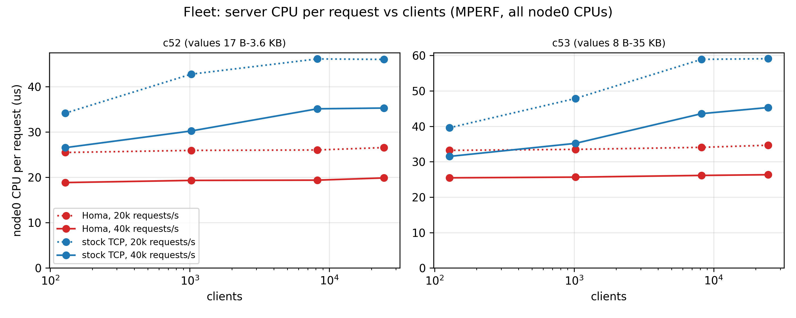
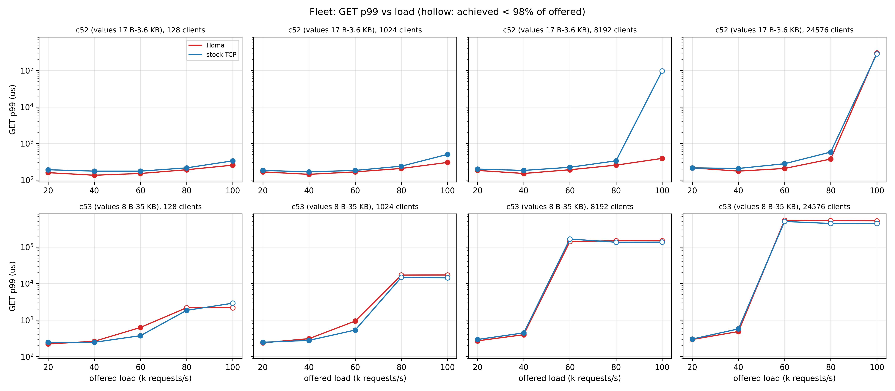
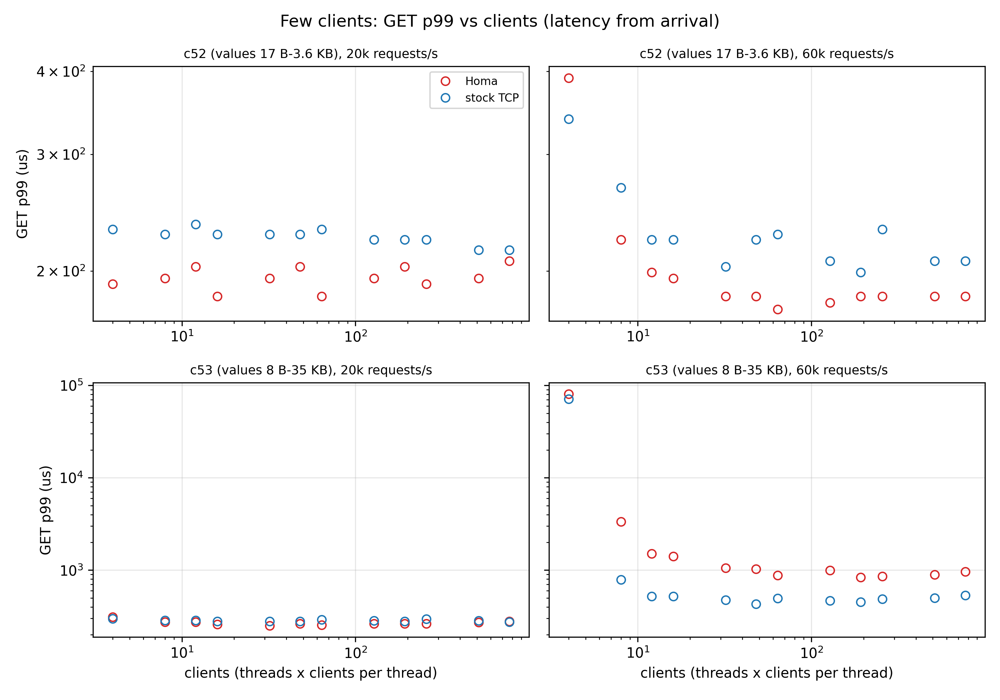

# Redis over Homa: a client fleet against one shard

One Redis shard serving a fleet of independent clients, over Homa and over stock TCP, on 2x
CloudLab Utah xl170 (25 Gb/s). The question is what Homa changes for Redis as deployed: many
application clients, each with its own connection and one request at a time, with request sizes
and mixes taken from a production cache trace.

## The model

| Element | Choice | Why |
|---|---|---|
| Server | one redis-server, single-threaded (`--io-threads 1`), pinned to one core | one Redis shard; the same CPU budget for both transports |
| Clients | N independent clients, each one TCP connection or one Homa socket, one request in flight | an application fleet using synchronous client libraries (redis-py, Jedis, hiredis) with connection pools |
| Arrivals | open loop: each client's requests are a Poisson process of LOAD/N per second | clients do not slow down when the server does; offered load is fixed |
| Latency | from the request's arrival to its reply | includes the wait behind the client's own request in flight |
| Requests | value sizes and SET:GET ratio of two clusters of the Twitter cache trace (Yang et al., OSDI'20, CMU PDL `sample100`) | production mixes, not synthetic sizes |
| Keys | 100,000, all preloaded, drawn uniformly | every GET hits |
| Baseline | stock TCP: `homa.ko` unloaded, default qdisc, RSS only | Homa's own configuration slows TCP (RPS/RFS onto the Redis core, `sch_homa`, the GRO hook) |

| Workload | Values (weighted by requests) | SET:GET | Trace cluster |
|---|---|---|---|
| c52 | 17 B-3.6 KB, mostly 27 B | 7:93 | the busiest cluster whose mean value exceeds 100 B (third of 54 by request rate) |
| c53 | 8 B-35 KB, a fifth of the GETs over 16 KB | 13:87 | values spread over four orders of magnitude |

With one request in flight per client, neither transport can batch requests of one client, and
Redis's in-order execution of one client's commands never holds back another client. What remains is
what differs between the transports across clients: the kernel state and work per connection (TCP
keeps a socket per client, Homa one socket for all) and the order in which replies of different
sizes leave the server (TCP per connection in byte order, through shared NIC queues; Homa shortest
remaining message first).

Two sweeps:

- **fleet**: 16 client threads x 8, 64, 512, 1536 clients per thread (N = 128 to 24,576) x offered
  load 20k-100k requests/s, 3 rounds.
- **few clients**: 4, 8, 12 threads x 1, 4, 16, 64 clients per thread (N = 4 to 768) x 20k and 60k
  requests/s, 2 rounds.

Every run starts on a fresh redis-server once node0 is idle, preloads the keys, warms the clients
up for 5 s (not counted) and measures 20 s. CPU is MPERF/TSC on every CPU of both nodes, sampled
for 4 s mid-run. Tables give the median over rounds.

## Findings

1. **Homa needs less server CPU per request, and its cost does not grow with the number of
   clients.** At 40k requests/s, node0 spends 18.8-19.9 us per request over Homa from 128 to 24,576
   clients (c52), against 26.5-35.3 us over stock TCP; with c53, 25.5-26.3 against 31.5-45.3 us.
   Homa saves 29-44% (c52) and 19-42% (c53), the most with the most clients.
2. **Small values (c52): Homa's GET p99 is never higher at a load both sustain, and Homa has the
   higher capacity at 8,192 clients.** p99 is up to 40% lower over Homa (equal at 24,576 clients and
   20k requests/s). At 8,192 clients and 100k requests/s stock TCP falls behind (86k achieved, p99
   97 ms) while Homa keeps up (p99 391 us). Homa's p99.9 is worse at 8,192 clients from 60k
   requests/s (2.7 and 13 ms against 0.5 and 5.8 ms at 60k and 80k).
3. **Multi-KB values (c53): stock TCP has the higher capacity at every client count.** Saturated
   throughput (at 100k offered) is 83.7k vs 68.6k requests/s (128 clients), 78.0k vs 63.8k (1,024),
   60.2k vs 56.7k (8,192) and 54.8k vs 51.4k (24,576), stock TCP vs Homa. Below saturation the p99s
   are within 15% of each other up to 40k requests/s; at 60k stock TCP's is 41-43% lower (128 and
   1,024 clients). The single Redis core sets capacity, and Homa does more work there per request
   than TCP (one `recvmsg` and one `sendmsg` per message, a whole multi-KB message copied in one
   call; +1.6 us per 100 B GET in the profile of `homa-6.17.8-artifact`) although it does less on
   the node as a whole. The fleet runs did not profile the Redis core.
4. **Few clients (4-768): TCP's extra cost starts with the first connections.** With 4 clients node0
   spends as much per request over stock TCP as over Homa (c52 at 60k: 17.3 us each); stock TCP's
   cost grows with the client count (20.1 us at 16, 22.8 us at 768) while Homa's stays at 16.6-17.3.
   Homa's GET p99 is lower at every point with small values (c52: 4-21% at 20k requests/s, 8-23% at
   60k) except 4 clients at 60k (391 vs 339 us). With c53 the p99s are within 12% at 20k; at 60k,
   close to Homa's capacity, stock TCP's is 1.8-4.2x lower (8-768 clients).

In short: Homa's gain on a Redis shard is the per-connection cost of TCP. It shows in server CPU
from a dozen clients on, and in tail latency and capacity once values are small and clients are
many. Avoiding head-of-line blocking between replies does not outweigh Homa's per-message cost on
the single Redis core when values reach tens of KB.





## Results

### Fleet (16 threads, 3 rounds)

c52: GET p99 us, Homa / stock TCP (* achieved < 98% of offered)

| clients | 20k | 40k | 60k | 80k | 100k |
|---|---|---|---|---|---|
| 128 | 159 / 191 | 135 / 175 | 151 / 175 | 191 / 215 | 255 / 335 |
| 1024 | 167 / 183 | 143 / 167 | 167 / 183 | 207 / 239 | 303 / 503 |
| 8192 | 183 / 199 | 151 / 183 | 191 / 223 | 255 / 335 | 391 / 97279* |
| 24576 | 215 / 215 | 175 / 207 | 207 / 279 | 375 / 583 | 303103* / 286719* |

c53: GET p99 us, Homa / stock TCP (* achieved < 98% of offered)

| clients | 20k | 40k | 60k | 80k | 100k |
|---|---|---|---|---|---|
| 128 | 223 / 247 | 263 / 247 | 631 / 375 | 2191* / 1855 | 2191* / 2911* |
| 1024 | 239 / 247 | 311 / 279 | 943 / 535 | 17151* / 14911* | 17279* / 14399* |
| 8192 | 271 / 295 | 399 / 447 | 142335* / 166911* | 149503* / 136191* | 150527* / 137215* |
| 24576 | 295 / 303 | 487 / 575 | 544767* / 505855* | 532479* / 444415* | 528383* / 446463* |

c52: achieved k requests/s at the highest offered load (100k) and node0 CPU us per request at 40k, Homa / stock TCP

| clients | achieved | node0 CPU us/request at 40k | busiest node0 CPU % at 40k |
|---|---|---|---|
| 128 | 100.1 / 100.1 | 18.8 / 26.5 | 53 / 60 |
| 1024 | 100.0 / 100.0 | 19.3 / 30.2 | 55 / 62 |
| 8192 | 99.9 / 86.1 | 19.4 / 35.1 | 55 / 65 |
| 24576 | 88.4 / 87.3 | 19.9 / 35.3 | 57 / 66 |

c53: achieved k requests/s at the highest offered load (100k) and node0 CPU us per request at 40k, Homa / stock TCP

| clients | achieved | node0 CPU us/request at 40k | busiest node0 CPU % at 40k |
|---|---|---|---|
| 128 | 68.6 / 83.7 | 25.5 / 31.5 | 70 / 70 |
| 1024 | 63.8 / 78.0 | 25.6 / 35.2 | 71 / 73 |
| 8192 | 56.7 / 60.2 | 26.1 / 43.6 | 73 / 81 |
| 24576 | 51.4 / 54.8 | 26.3 / 45.3 | 74 / 83 |

### Few clients (2 rounds)

c52: few clients, GET p99 us, Homa / stock TCP

| threads x clients per thread | clients | 20k | 60k |
|---|---|---|---|
| 4 x 1 | 4 | 191 / 231 | 391 / 339 |
| 4 x 4 | 16 | 183 / 227 | 195 / 223 |
| 4 x 16 | 64 | 183 / 231 | 175 / 227 |
| 4 x 64 | 256 | 191 / 223 | 183 / 231 |
| 8 x 1 | 8 | 195 / 227 | 223 / 267 |
| 8 x 4 | 32 | 195 / 227 | 183 / 203 |
| 8 x 16 | 128 | 195 / 223 | 179 / 207 |
| 8 x 64 | 512 | 195 / 215 | 183 / 207 |
| 12 x 1 | 12 | 203 / 235 | 199 / 223 |
| 12 x 4 | 48 | 203 / 227 | 183 / 223 |
| 12 x 16 | 192 | 203 / 223 | 183 / 199 |
| 12 x 64 | 768 | 207 / 215 | 183 / 207 |

c53: few clients, GET p99 us, Homa / stock TCP

| threads x clients per thread | clients | 20k | 60k |
|---|---|---|---|
| 4 x 1 | 4 | 311 / 299 | 80639* / 71423 |
| 4 x 4 | 16 | 259 / 279 | 1415 / 519 |
| 4 x 16 | 64 | 255 / 291 | 875 / 495 |
| 4 x 64 | 256 | 263 / 295 | 859 / 487 |
| 8 x 1 | 8 | 275 / 287 | 3343 / 791 |
| 8 x 4 | 32 | 251 / 279 | 1051 / 475 |
| 8 x 16 | 128 | 263 / 283 | 999 / 467 |
| 8 x 64 | 512 | 271 / 283 | 891 / 499 |
| 12 x 1 | 12 | 275 / 287 | 1511 / 519 |
| 12 x 4 | 48 | 263 / 279 | 1031 / 431 |
| 12 x 16 | 192 | 263 / 279 | 839 / 451 |
| 12 x 64 | 768 | 279 / 275 | 963 / 535 |

c52: few clients, node0 CPU us per request, Homa / stock TCP

| clients | 20k | 60k |
|---|---|---|
| 4 | 25.4 / 28.1 | 17.3 / 17.3 |
| 8 | 25.5 / 29.7 | 16.8 / 17.7 |
| 12 | 25.7 / 32.0 | 16.7 / 17.9 |
| 16 | 26.0 / 32.4 | 17.0 / 20.1 |
| 32 | 26.1 / 32.6 | 16.9 / 20.3 |
| 48 | 25.8 / 33.0 | 16.7 / 21.2 |
| 64 | 25.3 / 34.2 | 16.7 / 21.6 |
| 128 | 26.5 / 33.7 | 16.6 / 21.4 |
| 192 | 25.9 / 34.3 | 16.8 / 22.1 |
| 256 | 25.7 / 35.0 | 16.7 / 22.1 |
| 512 | 25.7 / 38.5 | 16.7 / 21.9 |
| 768 | 25.8 / 41.2 | 16.6 / 22.8 |

c53: few clients, node0 CPU us per request, Homa / stock TCP

| clients | 20k | 60k |
|---|---|---|
| 4 | 33.3 / 31.8 | 23.3 / 23.6 |
| 8 | 33.2 / 33.7 | 21.0 / 23.2 |
| 12 | 33.3 / 36.0 | 21.0 / 23.5 |
| 16 | 33.0 / 35.8 | 21.0 / 24.4 |
| 32 | 32.8 / 38.7 | 21.0 / 25.9 |
| 48 | 33.2 / 38.6 | 21.1 / 25.3 |
| 64 | 32.9 / 39.1 | 21.1 / 26.1 |
| 128 | 33.1 / 39.9 | 21.2 / 26.3 |
| 192 | 33.1 / 39.3 | 21.2 / 26.5 |
| 256 | 33.2 / 41.0 | 21.1 / 26.4 |
| 512 | 33.9 / 44.2 | 21.2 / 26.8 |
| 768 | 33.3 / 45.8 | 21.2 / 27.2 |

## Setup

| Item | Value |
|---|---|
| Nodes | 2x CloudLab Utah xl170, one LAN: node0 = 10.0.1.1 (Redis), node1 = 10.0.1.2 (clients) |
| CPU / NIC | Intel Xeon E5-2640 v4 (10 cores / 20 threads, 25 MB L3); Mellanox ConnectX-4 25 Gb/s |
| OS / kernel | Ubuntu 24.04, mainline 6.17.8-061708-generic, `mitigations=off` |
| Homa | PlatformLab/HomaModule `main` @ `1c59d7b6`, official CloudLab config (`config default`) |
| Redis | uoenoplab/smt-redis tag `homa-6.17.8-xl170-20261006` (`f749cd4dd`), one instance on node0 CPU 7, TCP port 6379, Homa port 2000 |
| Load generator | uoenoplab/memtier_benchmark branch `homa` (on redis/memtier_benchmark `7a6394e`), on node1 CPUs 0-3, 5-13, 15-18 |
| Homa timer | the `homa_timer` kthread pinned to CPU 19 on both nodes |
| node1 sysctls | `ip_local_port_range 1024 65535`, `tcp_tw_reuse 1` (24,576 client connections per run); `icmp_ratelimit 0` on both nodes |

memtier's `homa` branch adds:

| Option | What it does |
|---|---|
| `--homa` | each client is one Homa socket with one RPC in flight; memtier's protocol code is unchanged |
| `--rate-poisson=R` | each client's requests are a Poisson process of R per second, on absolute times; latency counts from the arrival |
| `--sample-mix` | each request's type and value size drawn at random by `--ratio` and the `--data-size-list` weights |
| `--warmup=S` | requests sent in the first S seconds are not counted |
| `--no-per-second-percentiles` | skips per-client per-second percentile summaries, which stall worker threads at thousands of clients |

The fleet sweep ran memtier `9006af8`, which timed latency from the send; `7f8b5a3`, used for the
few-clients sweep, times it from the arrival. In the fleet sweep a client receives at most
100k/128 = 781 requests/s, so it is busy with the previous request for at most about 10% of the
time and the two differ little there.

## Reproduce

Provision the nodes, install the kernel, deploy Homa and build Redis as in steps 1-4 of the
`homa-6.17.8-artifact` branch (NAPI here: node0 CPU 1, node1 CPU 4). Then, on node1:

```bash
sudo apt-get install -y build-essential autoconf automake libpcre3-dev libevent-dev pkg-config zlib1g-dev libssl-dev
git clone -b homa https://github.com/uoenoplab/memtier_benchmark ~/memtier_benchmark
cd ~/memtier_benchmark && autoreconf -ivf && ./configure && make -j16
for h in node0 node1; do scp busy-cores.sh homa-timer-busy.sh $h:; done
```

and run (about 3 h for the fleet sweep, 2 h for the few-clients one):

```bash
tmux new -d -s fleet '
  TRANSPORTS=homa bash fleet-xl170.sh > fleet-homa.csv
  export THREADS="4 8 12" CPT="1 4 16 64" LOADS="20000 60000" ROUNDS=2
  TRANSPORTS=homa bash fleet-xl170.sh > sweep-homa.csv; unset THREADS CPT LOADS ROUNDS
  bash tcpclean.sh on
  TRANSPORTS=tcp bash fleet-xl170.sh > fleet-stocktcp.csv
  THREADS="4 8 12" CPT="1 4 16 64" LOADS="20000 60000" ROUNDS=2 TRANSPORTS=tcp bash fleet-xl170.sh > sweep-stocktcp.csv
  bash tcpclean.sh off'
uv run --with matplotlib python plot.py   # figures, and the tables above
```

| File | What |
|---|---|
| `fleet-xl170.sh` | the driver: fresh server, preload, memtier, CPU sampling; one CSV row per run |
| `tcpclean.sh` | `on`: unload `homa.ko`, default qdisc, RSS only (stock TCP); `off`: Homa's config again |
| `busy-cores.sh`, `homa-timer-busy.sh` | per-CPU busy % (MPERF/TSC); busy % of the `homa_timer` kthread |
| `results/` | `fleet-{homa,stocktcp}.csv`, `sweep-{homa,stocktcp}.csv`, one row per run |
| `plot.py` | `fleet-cpu.png`, `fleet-p99.png`, `sweep-p99.png` and the tables |

Columns: `get_p50_us` .. `set_p99_us` are memtier's percentiles; `server_busy_sum` / `_max` are the
sum and the maximum of node0's per-CPU busy % (`client_` for node1); `*_homa_timer_pct` is the busy
% of that node's `homa_timer` kthread.

## Limitations

- **One client host.** Every client runs on node1, so node1 holds all N Homa sockets, and
  `homa_timer`, which visits every socket of its host each tick, takes 40% of a CPU at 8,192
  clients and 68% at 24,576; at 24,576 clients and 100k requests/s it saturates its CPU (96%), so
  that point measures the client host, not Redis. A real fleet spreads its sockets over many hosts.
  For the same reason Homa's server sees one peer host, where a real one would track many.
- **What limits Homa at saturation is not established.** There node0's busiest CPU is 87-91% busy
  over Homa and 94-96% over stock TCP.
- The stock-TCP runs form one block after the Homa runs (`homa.ko` can only be unloaded with no
  Homa socket open).
- Keys are drawn uniformly, not with the trace's skew (Zipf 1.2); every write type of the trace
  (add, cas, prepend, set) is sent as a SET.
- One Redis shard on one core: no multi-shard host, no incast (which needs more than two machines).
